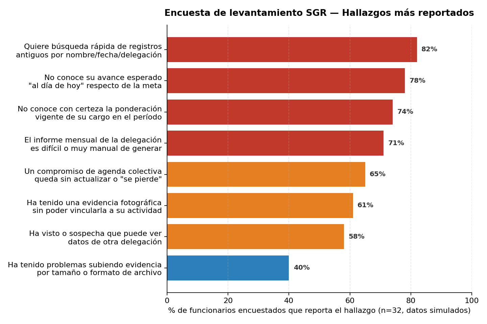

# Actividad 1 — Técnicas para la toma de requerimientos

**Ponderación en la rúbrica: 25 %**

**Depende de:** [`decisiones.md`](./decisiones.md) — se usan los mismos códigos de `guia-sgr.md` (no se
renumeran). **Alcance: MVP de `guia-sgr.md` §13.2** (decisión cerrada, ver `decisiones.md` § Alcance
del MVP). La sección 2 de este documento incluye solo los RF/RNF del MVP, y la sección 3 las 8 épicas
(todas aparecen, aunque no todas con sus HU completas) con únicamente las HU del MVP — ver el detalle
en `decisiones.md` y en la nota de alcance inmediatamente más abajo.

**Alimenta a:** Actividad 3 (los códigos de RF/RNF/EP/HU definidos aquí son los que se usan en los
diagramas de casos de uso, el diagrama de requerimientos en árbol y la matriz de trazabilidad). Cualquier
cambio de nombre o alcance hecho después de cerrar esta actividad debe avisarse a quien trabaje la
Actividad 3.

**Fuentes consultadas:** `fuentes/que-hacer-1-2-3.md`, `fuentes/guia-sgr.md` (RF §5, RNF §6, reglas de
negocio §7, entidades §8, épicas y HU §12, MVP §13.2), `fuentes/audio-clase-1.md` y
`fuentes/audio-clase-2.md`, `fuentes/apuntes-cocreacion-patrones.md` (marco teórico de técnicas de
cocreación/levantamiento y clasificación de RNF según Sommerville — usado solo como respaldo
conceptual, no como fuente de RF/RNF del caso, que viene únicamente de `guia-sgr.md`).

---

> ### Nota de alcance y supuestos aplicados (documentados según la regla de interpretación de
> `guia-sgr.md`: "las ambigüedades no se resuelven silenciosamente")
>
> 1. **Número de HU del MVP — 23, no 22.** `decisiones.md` y este mismo archivo (en su versión plantilla)
>    mencionan "22 HU marcadas P1". Al sumar la tabla por épica y la lista de HU excluidas
>    (HU-03, HU-08, HU-15, HU-19, HU-21, HU-22, HU-24, HU-31 = 8 HU) contra el total de 31, resulta 31 − 8 = **23 HU**, cifra que
>    coincide exactamente con las HU marcadas `P1` en `guia-sgr.md` §12. Se trabajó con **23 HU** en
>    todo este documento; se deja esta nota para que quien tome los códigos en la Actividad 3 no se
>    confunda con el "22" mencionado en otros archivos del repositorio.
> 2. **Tamaño del equipo — 4 integrantes.** Confirmado por el equipo (autorizado por el docente) y
>    consistente con la nota ya existente en la sección 4 de esta misma plantilla ("tamaño del equipo
>    (4 personas)") y con el README del repositorio.
> 3. **Técnica(s) de levantamiento — Taller de cocreación + Encuesta**, combinando profundidad
>    cualitativa y participativa (taller, alineado con el nombre de la unidad y el criterio de rúbrica
>    2.1.3) con alcance cuantitativo (encuesta, que permite tabular resultados de forma más objetiva,
>    criterio 2.1.1).
> 4. **Herramienta de planificación (§5):** se entrega el backlog en formato tabla lista para copiar en
>    GitHub Projects ("GCAP") y una carta Gantt por sprint. No fue posible crear un tablero real en
>    GitHub ni hacer *push* al repositorio del equipo desde este entorno (no hay credenciales
>    configuradas); el equipo debe crear el tablero real a partir de esta tabla.

---

## 1. Técnicas e instrumentos de toma de requerimientos

> El caso SGR viene definido por el docente: esto no es "inventar" el problema, sino simular y
> documentar el proceso de levantamiento como si se hubiese realizado con el cliente (la Ilustre
> Municipalidad de La Serena). **Todos los datos de participantes, respuestas y porcentajes que
> siguen son simulados/ficticios**, construidos para efectos de esta actividad académica; no
> corresponden a personas ni registros reales.

### 1.1 Técnica(s) elegida(s) y justificación

Se aplicaron **dos técnicas complementarias** de levantamiento de requerimientos:

**a) Taller de cocreación.** Sommerville define un requerimiento como la descripción de un servicio
que debe entregar un sistema junto con sus restricciones de operación, y describe la obtención de
requisitos como un proceso de comunicación continua con los interesados (Sommerville, 2020, según lo
sintetizado en `apuntes-cocreacion-patrones.md`). El taller de cocreación es la técnica que mejor
recoge esa idea de comunicación conjunta: reúne en una misma sesión a actores con visiones distintas
del proceso (quien registra, quien verifica, quien coordina y quien administra), lo que permite
levantar tensiones y expectativas cruzadas —por ejemplo, entre lo que un Funcionario puede registrar y
lo que un Verificador necesita para aprobarlo— que una técnica aplicada por separado no deja ver con la
misma claridad. Además, conecta directamente con el nombre de la unidad ("Co-creación, patrones y
requerimiento del software") y con el criterio de rúbrica 2.1.3, centrado en técnicas de cocreación y
en la validación participativa con el cliente.

**b) Encuesta.** Se usó como técnica complementaria para **cuantificar** qué tan extendidos están los
problemas detectados cualitativamente en el taller, y para llegar a funcionarios de más delegaciones de
las que alcanza a cubrir un taller presencial de pocas personas. Esto da al levantamiento un componente
de análisis de datos tabulado (criterio 2.1.1) además del cualitativo.

No se usaron entrevistas individuales por separado: el taller ya concentra la interacción directa con
los distintos roles, y aplicar además entrevistas habría duplicado el mismo tipo de información
cualitativa sin agregar una perspectiva nueva frente a la que aporta la encuesta.

### 1.2 Instrumento aplicado

#### a) Pauta del Taller de Cocreación SGR

| Campo | Detalle |
|---|---|
| Objetivo | Relevar el proceso actual de gestión de resultados (hoy en planillas de Google Sheets) y las necesidades no cubiertas, de forma participativa entre distintos roles. |
| Participantes simulados | 7 personas: 1 Administrador municipal, 1 Coordinador del sistema, 2 Delegados (Delegación Centro y Delegación Rural, ficticias), 2 Funcionarios (de distintas delegaciones ficticias) y 1 Verificador. |
| Duración | 90 minutos. |
| Materiales | Post-its, pizarra o tablero digital, votación por puntos (*dot voting*). |

**Dinámica:**
1. Presentación breve del flujo actual en Google Sheets (10 min).
2. Mapeo de historias de usuario: cada participante escribe en post-its las dificultades y
   necesidades que identifica en su rol (lluvia de ideas silenciosa) y luego se agrupan por tema en
   conjunto (30 min).
3. Priorización por votación: cada participante dispone de 3 votos para repartir entre los temas
   agrupados (20 min).
4. Discusión abierta guiada por preguntas, una por bloque temático (30 min).

**Preguntas guía (por bloque temático):**

| Bloque | Pregunta guía |
|---|---|
| Configuración organizacional | ¿Cómo definen hoy los cargos, funciones y ponderadores de cada uno? ¿Qué pasa cuando cambian a mitad de período? |
| Registro y evidencias | ¿Cómo registra hoy un funcionario una actividad? ¿Cómo asocia la fotografía de respaldo? |
| Verificación | ¿Cómo se decide si una evidencia es válida o no? ¿Queda algún registro de esa decisión? |
| Agenda colectiva | ¿Qué pasa cuando un compromiso con la comunidad no se cumple a tiempo? |
| Medición y semáforo | ¿Cómo saben, en cualquier momento del mes, si van bien o mal respecto de la meta? |
| Reportabilidad | ¿Cómo arman hoy el informe mensual de la delegación? |
| Seguridad y trazabilidad | ¿Alguna vez han visto datos de otra delegación? ¿Se sabe quién cambió una meta o un ponderador? |

#### b) Formulario de Encuesta SGR

Aplicado a **32 funcionarios simulados**, de 6 delegaciones ficticias (Centro, Rural, Costa,
Cordillera, Norte y Sur), modalidad *online*, con preguntas cerradas y de escala.

| N.º | Pregunta | Tipo de respuesta |
|---|---|---|
| 1 | ¿Con qué frecuencia registra sus actividades diarias en alguna planilla o sistema? | Diariamente / 2-3 veces por semana / Semanalmente / Rara vez |
| 2 | ¿Sabe cuál es la ponderación vigente de cada ítem de su cargo en el período actual? | Sí, con certeza / Más o menos / No |
| 3 | ¿Ha tenido una evidencia fotográfica que no pudo vincular con claridad a una actividad específica? | Sí / No |
| 4 | ¿Ha tenido problemas al subir una fotografía como evidencia (tamaño o formato del archivo)? | Sí / No |
| 5 | ¿Ha visto, o sospecha que podría ver, información de una delegación distinta a la propia? | Sí / No / No sabe |
| 6 | ¿Con qué frecuencia un compromiso de la agenda colectiva queda "perdido" o sin actualizar? | Nunca / A veces / Frecuentemente |
| 7 | ¿Sabe cuál es su avance esperado "hasta hoy" respecto de su meta del período? | Sí / No |
| 8 | ¿Cómo calificaría la facilidad para generar el informe mensual de su delegación? | Escala 1 (muy difícil) a 5 (muy fácil) |
| 9 | ¿Le gustaría poder buscar rápidamente un registro antiguo por nombre, fecha o delegación? | Sí / No |
| 10 | ¿Le gustaría recibir alertas automáticas de compromisos por vencer? | Sí / No |
| 11 | En una escala de 1 a 5, ¿qué tan urgente considera contar con un sistema único para todo esto? | Escala 1 a 5 |

### 1.3 Tabulación y análisis de los datos

**a) Resultados del Taller de Cocreación** (n = 7 participantes, 21 votos de priorización en total)

| Hallazgo | Descripción | Mencionado por (de 7 participantes) | Votos de priorización (de 21) |
|---|---|---|---|
| H-01 | Cada delegación configura cargos, funciones, catálogos de actividades/servicios y períodos de medición en hojas de cálculo propias, sin una fuente única ni control de versión. | 7 | 3 |
| H-03 | Los funcionarios registran actividades en planillas separadas, sin un identificador único que las vincule con su fotografía de respaldo. | 6 | 3 |
| H-05 | Los verificadores aprueban o rechazan evidencias de palabra o por chat, sin dejar un registro formal del motivo de la decisión. | 5 | 3 |
| H-06 | No existe un panel único que muestre cargo, metas y avance de un funcionario; hay que solicitarlo a Coordinación. | 4 | 1 |
| H-08 | No existe alerta cuando un compromiso está por vencer; los delegados suelen enterarse solo cuando el vecino reclama. | 6 | 2 |
| H-09 | Los cálculos de avance y cumplimiento se hacen a mano en planillas Excel, y cada delegación aplica una fórmula distinta. | 7 | 3 |
| H-13 | El informe mensual de gestión se arma a mano, combinando archivos de todas las delegaciones. | 5 | 2 |
| H-14 | Dos delegaciones reportaron haber perdido cambios al editar la misma planilla de Google Sheets al mismo tiempo. | 6 | 2 |
| H-16 | No hay forma de saber quién modificó una meta o un ponderador después de cerrado un período. | 4 | 1 |
| H-17 | Los delegados piden recibir alertas automáticas de vencimientos en vez de enterarse "por casualidad". | 5 | 1 |

Los temas con más votos (H-01 y H-09, ambos con 3 votos) coinciden en apuntar a la falta de una fuente
única de configuración y cálculo, lo que orientó a priorizar en el MVP las épicas EP-01, EP-02 y EP-08
por sobre otras de menor urgencia relativa para el grupo (como EP-07, que igualmente quedó incluida por
su relevancia estructural para trabajo simultáneo entre delegaciones).

**b) Resultados de la Encuesta** (n = 32 funcionarios simulados, 6 delegaciones ficticias)

| Hallazgo | Descripción | Resultado |
|---|---|---|
| H-02 | El 74 % de los coordinadores encuestados no sabe con certeza cuál es la ponderación vigente de cada ítem de su cargo en el período actual. | 74 % |
| H-04 | El 61 % ha tenido una evidencia fotográfica que no pudo vincular con claridad a su actividad; un 40 % adicional reporta problemas de tamaño o formato al subir un archivo. | 61 % (+ 40 % adicional) |
| H-07 | El 65 % reporta que un compromiso de agenda colectiva "se pierde" o queda sin actualizar cuando cambia de responsable. | 65 % |
| H-10 | El 78 % no sabe cuál es su meta esperada "al día de hoy"; solo la conoce al cierre del período. | 78 % |
| H-11 | El 71 % de los coordinadores arma el resumen de su delegación copiando y pegando datos de las planillas de cada funcionario. | 71 % |
| H-12 | El 82 % quiere poder buscar un registro antiguo por nombre, fecha o delegación sin recorrer varias hojas. | 82 % |
| H-15 | El 58 % dice haber visto, o sospecha que podría ver, datos de una delegación distinta a la propia. | 58 % |

Los tres hallazgos más reportados (H-12 con 82 %, H-10 con 78 % y H-02 con 74 %) están relacionados con
falta de visibilidad de información ya existente (búsqueda, avance esperado, ponderación vigente) más
que con falta de funcionalidad nueva, lo que refuerza la importancia de las épicas EP-05 (monitoreo) y
EP-06 (reportabilidad) dentro del MVP.

### 1.4 Derivación de requerimientos

Cada hallazgo del taller o de la encuesta se tradujo en uno o más RF; los RNF citados directamente
(RNF-003, RNF-004, RNF-005, RNF-008 y RNF-017) también se sustentan en un hallazgo concreto. Los 13 RNF
restantes son atributos de calidad que **cualquier** sistema de este tipo debería cumplir
independientemente de si un participante los mencionó explícitamente (por ejemplo, nadie en el taller
va a pedir "quiero que el sistema tenga alta disponibilidad", pero eso no significa que no se necesite);
por eso se incorporan por completitud del MVP, tal como lo permite `guia-sgr.md` §13.2, y se marcan como
tales en la tabla siguiente en lugar de inventarles un hallazgo que no existió.

| RF / RNF | Hallazgo(s) que lo sustenta(n) |
|---|---|
| RF-001 a RF-007 | H-01, H-02 |
| RF-009 a RF-012; RNF-017 | H-03, H-04 |
| RF-013 a RF-014 | H-05 |
| RF-008 | H-06 |
| RF-016 a RF-018 | H-07 |
| RF-019 a RF-021 | H-08 |
| RF-022 a RF-025 | H-09 |
| RF-026 a RF-028 | H-10 |
| RF-029, RF-031 | H-11 |
| RF-032 | H-12 |
| RF-033 | H-13 |
| RF-034; RNF-003 | H-14 |
| RNF-004, RNF-005 | H-15 |
| RF-036, RF-038; RNF-008 | H-16 |
| RF-037 | H-17 |
| RNF-001 | *Incluido por completitud del MVP (§13.2)* — ver nota debajo de la tabla |
| RNF-002 | *Incluido por completitud del MVP (§13.2)* — ver nota debajo de la tabla |
| RNF-006 | *Incluido por completitud del MVP (§13.2)* — ver nota debajo de la tabla |
| RNF-007 | *Incluido por completitud del MVP (§13.2)* — ver nota debajo de la tabla |
| RNF-009 | *Incluido por completitud del MVP (§13.2)* — ver nota debajo de la tabla |
| RNF-010 | *Incluido por completitud del MVP (§13.2)* — ver nota debajo de la tabla |
| RNF-011 | *Incluido por completitud del MVP (§13.2)* — ver nota debajo de la tabla |
| RNF-012 | *Incluido por completitud del MVP (§13.2)* — ver nota debajo de la tabla |
| RNF-013 | *Incluido por completitud del MVP (§13.2)* — ver nota debajo de la tabla |
| RNF-014 | *Incluido por completitud del MVP (§13.2)* — ver nota debajo de la tabla |
| RNF-015 | *Incluido por completitud del MVP (§13.2)* — ver nota debajo de la tabla |
| RNF-016 | *Incluido por completitud del MVP (§13.2)* — ver nota debajo de la tabla |
| RNF-018 | *Incluido por completitud del MVP (§13.2)* — ver nota debajo de la tabla |

*Nota sobre las filas "incluido por completitud del MVP": corresponden a los 13 RNF transversales
(RNF-001, RNF-002, RNF-006, RNF-007, RNF-009, RNF-010, RNF-011, RNF-012, RNF-013, RNF-014, RNF-015, RNF-016, RNF-018) que ningún hallazgo del taller o la encuesta mencionó de forma
puntual, pero que `guia-sgr.md` §13.2 exige mantener igualmente por ser atributos de calidad que
cualquier sistema de este tipo debe cumplir (disponibilidad, rendimiento, confidencialidad, etc.), y
no un problema aislado detectado en el levantamiento.*

---

## 2. Requerimientos Funcionales y No Funcionales

> Incluye únicamente los RF/RNF del MVP fijado en `decisiones.md` § Alcance del MVP (los que sustentan
> alguna de las 23 HU marcadas P1, más los RNF transversales). Quedan fuera del MVP:
> **RF-015** (asociado solo a HU-03 (P2, atención social secuenciada)); **RF-030** (asociado solo a HU-19 (P2, control de actividad de usuarios)); **RF-035** (asociado solo a HU-24 (P2, comunicación entre delegaciones)). Códigos según `decisiones.md`
> (numeración original de `guia-sgr.md`, sin renumerar). Cada RF/RNF es rastreable hasta la tabla de la
> sección 1.4.

### 2.1 Requerimientos Funcionales

**Configuración organizacional y de medición**

| Código | Descripción | Prioridad |
|---|---|---|
| RF-001 | Administrar delegaciones: crear, editar, activar y desactivar unidades organizacionales. | Alta |
| RF-002 | Administrar usuarios, roles y su asociación a cargo y delegación. | Alta |
| RF-003 | Asociar funciones e ítems medibles a cada cargo. | Alta |
| RF-004 | Mantener el catálogo de tipos de actividad, servicio y atención por área. | Alta |
| RF-005 | Configurar períodos de medición (inicio, término, días computables, estado). | Alta |
| RF-006 | Configurar el porcentaje de ponderación de cada ítem por cargo y período. | Alta |
| RF-007 | Configurar metas, umbral de cumplimiento y reglas del semáforo por ítem. | Alta |

**Registro personal y evidencias**

| Código | Descripción | Prioridad |
|---|---|---|
| RF-008 | Mostrar la ficha personal del funcionario (cargo, delegación, metas, avance, cumplimiento). | Alta |
| RF-009 | Registrar actividades diarias (fecha, acción, contacto, ítem, vínculo con agenda colectiva). | Alta |
| RF-010 | Validar obligatoriedad, formato y coherencia de los campos de una actividad antes de guardar. | Alta |
| RF-011 | Generar un código único e inmutable de evidencia al registrar una actividad. | Alta |
| RF-012 | Asociar una fotografía u otro archivo permitido a una actividad mediante su código. | Alta |
| RF-013 | Permitir que un verificador apruebe, rechace o pida corrección de una evidencia, con observación. | Alta |
| RF-014 | Incorporar al avance solo las actividades cuya evidencia fue validada como aprobada. | Alta |

**Agenda colectiva**

| Código | Descripción | Prioridad |
|---|---|---|
| RF-016 | Registrar compromisos futuros en la agenda colectiva, originados por solicitudes internas o externas. | Alta |
| RF-017 | Asignar a cada compromiso solicitante, territorio, responsable, área de apoyo y fecha comprometida. | Alta |
| RF-018 | Gestionar transiciones de estado del compromiso (Ingresado, Pendiente, En proceso, Realizado) con historial. | Alta |
| RF-019 | Identificar compromisos próximos a vencer, vencidos y realizados fuera de plazo. | Alta |
| RF-020 | Actualizar el indicador individual correspondiente cuando se cierra un compromiso validado. | Alta |
| RF-021 | Generar un resumen colectivo de compromisos por funcionario y estado, con % realizado y pendiente. | Alta |

**Cálculos, semáforos y tableros**

| Código | Descripción | Prioridad |
|---|---|---|
| RF-022 | Contabilizar automáticamente las actividades válidas por ítem, funcionario, delegación y período. | Alta |
| RF-023 | Calcular el porcentaje de cumplimiento de un ítem respecto de su meta. | Alta |
| RF-024 | Calcular el cumplimiento ponderado (% de cumplimiento × ponderador, respetando el máximo configurado). | Alta |
| RF-025 | Permitir incentivos y penalizaciones parametrizables (bonificaciones, reclamos). | Media |
| RF-026 | Calcular la meta esperada al día según los días transcurridos y la duración del período. | Alta |
| RF-027 | Clasificar el avance de cada funcionario en semáforo verde, ámbar o rojo según umbrales configurables. | Alta |
| RF-028 | Mostrar el tablero personal del funcionario (metas, avance, cumplimiento, evidencias, compromisos). | Alta |
| RF-029 | Consolidar el tablero de delegación (responsables, avance, semáforo, meta esperada, resultado global). | Alta |
| RF-031 | Mostrar una vista global por cargos, con navegación hacia el detalle de cada funcionario. | Media |

**Consulta, colaboración y administración**

| Código | Descripción | Prioridad |
|---|---|---|
| RF-032 | Buscar y filtrar información por delegación, área, funcionario, cargo, período, ítem, estado y fecha. | Alta |
| RF-033 | Generar y exportar informes en los formatos definidos por la institución. | Media |
| RF-034 | Permitir el registro concurrente de varias delegaciones sin sobrescribir información. | Alta |
| RF-036 | Registrar en una bitácora de trazabilidad las altas, modificaciones, validaciones y cambios de estado. | Alta |
| RF-037 | Emitir alertas por vencimientos, evidencias pendientes, ausencia de registro y avance bajo el umbral. | Media |
| RF-038 | Versionar metas, ponderadores, catálogos y reglas de cálculo, sin alterar períodos ya cerrados. | Alta |

### 2.2 Requerimientos No Funcionales

> Siguiendo la taxonomía de Sommerville citada en `apuntes-cocreacion-patrones.md`, la mayoría de estos
> RNF son **externos** (legislativos y de seguridad: RNF-004 a RNF-009; interoperabilidad: RNF-016) y
> **de producto** (eficiencia: RNF-002; fiabilidad: RNF-001, RNF-003, RNF-007, RNF-010; usabilidad:
> RNF-011, RNF-012); RNF-013 a RNF-015 y RNF-018 son más bien **organizacionales**, ligados a estándares
> de entrega y operación del propio equipo de desarrollo/mantención.

| Código | Atributo | Descripción | Prioridad | Origen |
|---|---|---|---|---|
| RNF-001 | Disponibilidad | Mantener el sistema disponible durante la jornada operativa y registrar toda indisponibilidad. | Alta | Transversal — incluido por completitud del MVP (§13.2) |
| RNF-002 | Rendimiento | Responder operaciones de registro/consulta en ≤ 2 s y tableros consolidados en ≤ 5 s en condiciones normales. | Alta | Transversal — incluido por completitud del MVP (§13.2) |
| RNF-003 | Concurrencia | Soportar trabajo simultáneo de varias delegaciones sin pérdida, duplicación ni sobrescritura silenciosa. | Alta | Citado directamente en un hallazgo (§1.4) |
| RNF-004 | Autenticación | Exigir identidad individual para todo acceso, con integración recomendada al directorio institucional. | Alta | Citado directamente en un hallazgo (§1.4) |
| RNF-005 | Autorización | Aplicar permisos por rol, delegación, función y operación, con mínimo privilegio y segregación de funciones. | Alta | Citado directamente en un hallazgo (§1.4) |
| RNF-006 | Confidencialidad | Cifrar las comunicaciones y proteger datos y evidencias en almacenamiento y respaldo. | Alta | Transversal — incluido por completitud del MVP (§13.2) |
| RNF-007 | Integridad | Validar formatos, relaciones, duplicados y cambios concurrentes antes de confirmar una operación. | Alta | Transversal — incluido por completitud del MVP (§13.2) |
| RNF-008 | Auditoría | Conservar usuario, fecha, acción, valor anterior y nuevo de todo evento crítico, protegidos contra alteración. | Alta | Citado directamente en un hallazgo (§1.4) |
| RNF-009 | Privacidad | Minimizar los datos personales y definir su visibilidad, conservación y eliminación. | Alta | Transversal — incluido por completitud del MVP (§13.2) |
| RNF-010 | Respaldo y recuperación | Respaldar la información de forma automatizada (RPO 24 h / RTO 4 h iniciales, por validar). | Alta | Transversal — incluido por completitud del MVP (§13.2) |
| RNF-011 | Usabilidad | Usar etiquetas comprensibles, validación contextual y filtros consistentes en las pantallas. | Media | Transversal — incluido por completitud del MVP (§13.2) |
| RNF-012 | Accesibilidad | Soportar navegación por teclado, contraste suficiente y textos alternativos. | Media | Transversal — incluido por completitud del MVP (§13.2) |
| RNF-013 | Compatibilidad | Operar en versiones institucionalmente soportadas de Chrome/Edge, en escritorio y en dispositivos móviles. | Media | Transversal — incluido por completitud del MVP (§13.2) |
| RNF-014 | Escalabilidad | Permitir incorporar nuevas delegaciones, cargos, actividades y usuarios sin rediseñar el modelo. | Media | Transversal — incluido por completitud del MVP (§13.2) |
| RNF-015 | Mantenibilidad | Permitir configurar metas, ponderadores, estados y catálogos sin cambios de código. | Media | Transversal — incluido por completitud del MVP (§13.2) |
| RNF-016 | Interoperabilidad | Permitir exportación estructurada y dejar preparada una integración futura controlada. | Media | Transversal — incluido por completitud del MVP (§13.2) |
| RNF-017 | Gestión de evidencias | Definir formatos permitidos, tamaño máximo, antivirus, metadatos y retención de archivos. | Alta | Citado directamente en un hallazgo (§1.4) |
| RNF-018 | Monitoreo | Generar métricas y alertas sobre errores, fallas de integración, capacidad y tareas automáticas. | Media | Transversal — incluido por completitud del MVP (§13.2) |

---

## 3. Épicas, Historias de Usuario y Tareas

### 3.1 Épicas cubiertas

Las 8 épicas de `guia-sgr.md` §12 están representadas, cada una únicamente con sus HU marcadas P1 (ver
la nota de alcance al inicio de este documento). No se agregaron HU-03, HU-08, HU-15, HU-19, HU-21,
HU-22, HU-24 ni HU-31: quedan fuera del MVP.

| Código | Nombre de la épica | Nº HU en el MVP | HU incluidas |
|---|---|---|---|
| EP-01 | Registro y gestión de actividades | 3 | HU-01, HU-02, HU-04 |
| EP-02 | Medición y desempeño | 3 | HU-05, HU-06, HU-07 |
| EP-03 | Evidencias y verificación | 3 | HU-09, HU-10, HU-11 |
| EP-04 | Agenda colectiva y compromisos | 3 | HU-12, HU-13, HU-14 |
| EP-05 | Monitoreo y control de gestión | 3 | HU-16, HU-17, HU-18 |
| EP-06 | Reportabilidad y toma de decisiones | 1 | HU-20 |
| EP-07 | Plataforma colaborativa | 2 | HU-23, HU-25 |
| EP-08 | Administración, seguridad y trazabilidad | 5 | HU-26, HU-27, HU-28, HU-29, HU-30 |

**Total HU incluidas en el MVP: 23 de 31.**

### 3.2 Historias de Usuario por épica

Formato: "Como [rol], quiero [acción], para [beneficio]", con criterios de aceptación en formato
Dado/Cuando/Entonces.

#### EP-01 — Registro y gestión de actividades

**HU-01. Registro de actividades**  
*Prioridad: P1 &nbsp;|&nbsp; Requisitos relacionados: RF-009, RF-010, RF-014, RF-022*
> Como Funcionario, quiero dejar registro diario de las actividades que realizo, para respaldar mi trabajo y aportar a la medición de mi gestión.

- **Criterio 1:** Dado que el funcionario inició sesión, cuando completa fecha, acción, contacto e ítem, entonces el sistema guarda el registro y lo deja disponible en su historial según sus permisos.
- **Criterio 2:** Dada una actividad con evidencia aprobada, cuando se valida, entonces aporta una única vez al avance del ítem correspondiente.

**HU-02. Registro de compromisos ciudadanos**  
*Prioridad: P1 &nbsp;|&nbsp; Requisitos relacionados: RF-016, RF-017, RF-018, RF-019, RF-020, RF-021*
> Como Funcionario, quiero registrar las solicitudes y compromisos que adquiero con la comunidad, para poder darles seguimiento y asegurar su cumplimiento.

- **Criterio 1:** Dado un compromiso nuevo, cuando se ingresa con solicitante, responsable, territorio y fecha comprometida, entonces queda disponible para los actores autorizados de la delegación.
- **Criterio 2:** Dado un compromiso vencido sin cierre, cuando se consulta la agenda, entonces aparece destacado como vencido.

**HU-04. Administración de funciones por cargo**  
*Prioridad: P1 &nbsp;|&nbsp; Requisitos relacionados: RF-003, RF-006, RF-007*
> Como Supervisor o Coordinador, quiero definir las funciones e indicadores de cada cargo, para evaluar la gestión con criterios ya configurados.

- **Criterio 1:** Dado un cargo existente, cuando se le asocian funciones, metas y ponderaciones, entonces esos ítems quedan vigentes para los funcionarios de ese cargo.
- **Criterio 2:** Dada una actualización de funciones, cuando se guarda, entonces rige desde su fecha de vigencia sin alterar períodos ya cerrados.

#### EP-02 — Medición y desempeño

**HU-05. Definición de metas**  
*Prioridad: P1 &nbsp;|&nbsp; Requisitos relacionados: RF-005, RF-006, RF-007*
> Como Coordinador, quiero asignar metas e indicadores medibles a cada cargo o funcionario, para evaluar el cumplimiento esperado en el período.

- **Criterio 1:** Dado un período abierto, cuando el coordinador crea una meta, entonces informa valor objetivo, unidad, ponderación y vigencia, validando que la suma de ponderadores del cargo sea 100 % (RN-001).
- **Criterio 2:** Dada una modificación de meta, cuando se confirma, entonces se registra su versión, autor y período de aplicación.

**HU-06. Seguimiento de avance**  
*Prioridad: P1 &nbsp;|&nbsp; Requisitos relacionados: RF-008, RF-022, RF-023, RF-028*
> Como Funcionario, quiero visualizar mi avance respecto de las metas definidas, para conocer mi nivel de cumplimiento y gestionar mis actividades.

- **Criterio 1:** Dado un funcionario autenticado, cuando accede a su panel, entonces visualiza metas, avance, cumplimiento y evidencias del período seleccionado.
- **Criterio 2:** Dadas nuevas actividades aprobadas, cuando se refresca el panel, entonces los indicadores se recalculan automáticamente.

**HU-07. Cálculo automático de cumplimiento**  
*Prioridad: P1 &nbsp;|&nbsp; Requisitos relacionados: RF-023, RF-024, RF-025, RF-026*
> Como Coordinador, quiero calcular automáticamente porcentajes y ponderaciones, para reducir errores y disponer de indicadores confiables.

- **Criterio 1:** Dada una meta mayor a cero y una ponderación vigente, cuando existen avances aprobados, entonces el sistema calcula el cumplimiento y su aporte ponderado.
- **Criterio 2:** Dado un registro aprobado o anulado, cuando cambia el avance, entonces los indicadores afectados se recalculan sin intervención manual.

#### EP-03 — Evidencias y verificación

**HU-09. Registro de evidencia fotográfica**  
*Prioridad: P1 &nbsp;|&nbsp; Requisitos relacionados: RF-012, RNF-017*
> Como Funcionario, quiero adjuntar evidencias a las actividades realizadas, para demostrar su ejecución de forma verificable.

- **Criterio 1:** Dada una actividad registrada, cuando se adjunta un archivo permitido, entonces la evidencia queda vinculada a su código y visible para usuarios autorizados.
- **Criterio 2:** Dada una carga que excede el tamaño o formato permitido, cuando se intenta subir, entonces se rechaza informando el motivo.

**HU-10. Generación de códigos verificadores**  
*Prioridad: P1 &nbsp;|&nbsp; Requisitos relacionados: RF-011*
> Como Funcionario, quiero obtener un identificador único por actividad, para vincular y localizar sus evidencias de respaldo.

- **Criterio 1:** Dada una actividad nueva válida, cuando se guarda, entonces se genera un identificador único e inmutable.
- **Criterio 2:** Dado un código conocido, cuando se busca, entonces se obtiene la actividad asociada si el usuario tiene autorización.

**HU-11. Validación de actividades**  
*Prioridad: P1 &nbsp;|&nbsp; Requisitos relacionados: RF-013, RF-014, RF-036*
> Como Verificador, quiero aprobar, rechazar o solicitar corrección de una evidencia, para controlar qué actividades aportan al resultado.

- **Criterio 1:** Dada una evidencia pendiente, cuando el verificador la revisa, entonces puede aprobarla, rechazarla o solicitar corrección dejando observación.
- **Criterio 2:** Dada una evidencia rechazada, cuando se consulta, entonces no aporta al avance hasta ser corregida y aprobada.

#### EP-04 — Agenda colectiva y compromisos

**HU-12. Agenda compartida**  
*Prioridad: P1 &nbsp;|&nbsp; Requisitos relacionados: RF-016, RF-017*
> Como Funcionario, quiero registrar compromisos futuros en una agenda colectiva, para informar al equipo sobre lo programado.

- **Criterio 1:** Dado un compromiso nuevo, cuando se registra, entonces queda visible para los usuarios autorizados de su ámbito, ordenado por fecha.
- **Criterio 2:** Dados varios compromisos, cuando se aplican filtros, entonces se puede acotar por responsable, estado, territorio y fecha.

**HU-13. Actualización de estados**  
*Prioridad: P1 &nbsp;|&nbsp; Requisitos relacionados: RF-018, RF-036*
> Como Funcionario, quiero actualizar el estado de un compromiso, para mantener informada a la organización sobre su avance.

- **Criterio 1:** Dado un compromiso registrado, cuando cambia su situación, entonces un usuario autorizado puede moverlo entre los estados permitidos, conservando el historial.
- **Criterio 2:** Dado un compromiso realizado, cuando se consulta, entonces refleja su cierre y deja de aparecer como pendiente.

**HU-14. Seguimiento de compromisos**  
*Prioridad: P1 &nbsp;|&nbsp; Requisitos relacionados: RF-019, RF-021, RF-037*
> Como Delegado, quiero monitorear compromisos pendientes, próximos a vencer y vencidos, para gestionar oportunamente los incumplimientos.

- **Criterio 1:** Dados compromisos vigentes, cuando el delegado abre el resumen, entonces visualiza pendientes, próximos a vencer, vencidos y realizados.
- **Criterio 2:** Dado un compromiso próximo a vencer, cuando alcanza el umbral configurado, entonces se destaca y puede generar una alerta.

#### EP-05 — Monitoreo y control de gestión

**HU-16. Semáforo de cumplimiento**  
*Prioridad: P1 &nbsp;|&nbsp; Requisitos relacionados: RF-026, RF-027*
> Como Funcionario, quiero visualizar un semáforo de avance diario, para saber si mi progreso está dentro del nivel esperado.

- **Criterio 1:** Dado un período vigente, cuando se calcula el avance esperado al día, entonces el sistema presenta un color de estado (verde, ámbar o rojo).
- **Criterio 2:** Dado un avance bajo el 60 % de lo esperado, cuando se visualiza, entonces se muestra en rojo; sobre lo esperado, en verde (RN-008).

**HU-17. Comparación entre avance esperado y real**  
*Prioridad: P1 &nbsp;|&nbsp; Requisitos relacionados: RF-023, RF-026, RF-027*
> Como Coordinador, quiero comparar el avance real con el esperado, para detectar desviaciones tempranas.

- **Criterio 1:** Dado un período en curso, cuando transcurren días computables, entonces el sistema calcula el porcentaje de avance esperado a la fecha.
- **Criterio 2:** Dado el avance real, cuando se compara con lo esperado, entonces la diferencia y el semáforo quedan visibles para los supervisores autorizados.

**HU-18. Resumen ejecutivo**  
*Prioridad: P1 &nbsp;|&nbsp; Requisitos relacionados: RF-028, RF-029, RF-031*
> Como Delegado, quiero consultar un panel resumen de indicadores, para disponer de una visión rápida del estado de la delegación.

- **Criterio 1:** Dada información consolidada, cuando el delegado ingresa al panel, entonces visualiza los indicadores clave del período y ámbito seleccionados.
- **Criterio 2:** Dada una consulta de gestión, cuando se revisa el resumen, entonces permite navegar desde el total hacia el detalle autorizado.

#### EP-06 — Reportabilidad y toma de decisiones

**HU-20. Generación de informes**  
*Prioridad: P1 &nbsp;|&nbsp; Requisitos relacionados: RF-032, RF-033*
> Como Coordinador, quiero obtener información consolidada de la gestión, para elaborar informes de desempeño y resultados.

- **Criterio 1:** Dados registros del sistema, cuando se genera un informe, entonces se consolida solo la información que cumple el período y filtros seleccionados.
- **Criterio 2:** Dado un informe exportado, cuando se descarga, entonces conserva encabezados, filtros aplicados y fecha de generación.

#### EP-07 — Plataforma colaborativa

**HU-23. Trabajo colaborativo en línea**  
*Prioridad: P1 &nbsp;|&nbsp; Requisitos relacionados: RF-034, RNF-003*
> Como Funcionario, quiero trabajar simultáneamente con otros usuarios, para mantener datos actualizados sin pérdida ni sobrescritura silenciosa.

- **Criterio 1:** Dados varios usuarios conectados, cuando guardan registros distintos al mismo tiempo, entonces ambos cambios permanecen íntegros.
- **Criterio 2:** Dada una modificación concurrente del mismo registro, cuando existe conflicto, entonces el sistema lo informa antes de sobrescribir.

**HU-25. Adaptación continua**  
*Prioridad: P1 &nbsp;|&nbsp; Requisitos relacionados: RF-038*
> Como Administrador, quiero modificar indicadores, ponderadores y estructuras de medición, para adaptar el sistema sin perder la historia.

- **Criterio 1:** Dado un administrador autorizado, cuando modifica un indicador o ponderador, entonces el sistema guarda el cambio con su vigencia.
- **Criterio 2:** Dadas modificaciones de configuración, cuando se aplican, entonces no alteran los resultados de períodos ya cerrados.

#### EP-08 — Administración, seguridad y trazabilidad

**HU-26. Administración de delegaciones, usuarios y roles**  
*Prioridad: P1 &nbsp;|&nbsp; Requisitos relacionados: RF-001, RF-002, RNF-004, RNF-005*
> Como Administrador, quiero gestionar unidades, usuarios, cargos y roles, para controlar el acceso según responsabilidad y ámbito.

- **Criterio 1:** Dada una delegación, cuando el administrador la crea, modifica o desactiva, entonces el cambio rige para futuras asignaciones sin borrar su historial.
- **Criterio 2:** Dado un usuario sin autorización, cuando intenta acceder fuera de su ámbito, entonces el acceso se deniega y el intento queda registrado.

**HU-27. Administración de catálogos**  
*Prioridad: P1 &nbsp;|&nbsp; Requisitos relacionados: RF-004*
> Como Administrador, quiero mantener catálogos de actividades, servicios, tipos y subtipos, para estandarizar la clasificación de los registros.

- **Criterio 1:** Dado un elemento de catálogo, cuando se crea o modifica, entonces se valida que su nombre o código sea único dentro del catálogo.
- **Criterio 2:** Dado un elemento usado históricamente, cuando se desactiva, entonces no puede seleccionarse en registros nuevos pero se conserva en los antiguos.

**HU-28. Administración de períodos**  
*Prioridad: P1 &nbsp;|&nbsp; Requisitos relacionados: RF-005*
> Como Coordinador, quiero crear, abrir y cerrar períodos de medición, para aplicar reglas y fechas consistentes a los cálculos.

- **Criterio 1:** Dado un período nuevo, cuando se configura, entonces la fecha de término no puede ser anterior al inicio y se calculan sus días computables.
- **Criterio 2:** Dado un período cerrado, cuando un usuario operativo intenta modificarlo, entonces la operación se rechaza salvo reapertura autorizada y auditada (RN-013).

**HU-29. Búsqueda y filtros**  
*Prioridad: P1 &nbsp;|&nbsp; Requisitos relacionados: RF-032*
> Como Usuario autorizado, quiero buscar y filtrar información por criterios operativos, para encontrar rápidamente registros y verificar los indicadores.

- **Criterio 1:** Dados registros existentes, cuando se filtran por delegación, funcionario, período, ítem, estado o fecha, entonces el resultado incluye solo coincidencias autorizadas.
- **Criterio 2:** Dado un usuario con ámbito restringido, cuando busca información, entonces no obtiene registros fuera de su autorización.

**HU-30. Auditoría de cambios**  
*Prioridad: P1 &nbsp;|&nbsp; Requisitos relacionados: RF-036, RNF-008*
> Como Administrador o Auditor, quiero consultar el historial de operaciones críticas, para saber quién cambió qué dato y cuándo.

- **Criterio 1:** Dada una operación crítica, cuando se ejecuta, entonces se registra usuario, fecha, acción, entidad y valores anterior/nuevo.
- **Criterio 2:** Dado un usuario autorizado, cuando consulta la auditoría, entonces puede filtrar eventos sin poder modificarlos ni eliminarlos.

### 3.3 Tareas por Historia de Usuario

| HU | Tarea | Descripción |
|---|---|---|
| HU-01 | T-01.1 | Diseñar la tabla `actividad` en la base de datos con los campos mínimos de §8.1 (fecha, acción, contacto, ítem, autor, indicador de agenda colectiva) |
| HU-01 | T-01.2 | Construir el endpoint `POST /actividades` con las validaciones de obligatoriedad y formato de RF-010 |
| HU-01 | T-01.3 | Construir el formulario de registro en el frontend, con validación en línea de los campos |
| HU-02 | T-02.1 | Diseñar la tabla `compromiso` con los campos de RF-016/RF-017 (solicitante, territorio, responsable, fecha) |
| HU-02 | T-02.2 | Construir el endpoint `POST /compromisos` y la máquina de estados de RF-018 |
| HU-02 | T-02.3 | Construir la vista de agenda colectiva con filtros por responsable/estado/fecha |
| HU-04 | T-04.1 | Modelar `cargo_funcion_item` con control de vigencia |
| HU-04 | T-04.2 | Construir el endpoint de administración de funciones e ítems por cargo (RF-003, RF-006, RF-007) |
| HU-04 | T-04.3 | Construir la pantalla de configuración para Supervisor/Coordinador |
| HU-05 | T-05.1 | Diseñar la tabla `meta` (ítem, funcionario/cargo, valor objetivo, unidad, ponderador, vigencia) |
| HU-05 | T-05.2 | Construir el CRUD de metas con versionado y validación de suma de ponderadores = 100 % (RN-001) |
| HU-05 | T-05.3 | Construir el formulario de definición de metas por período |
| HU-06 | T-06.1 | Implementar el servicio de cálculo de avance y cumplimiento por funcionario (RF-022, RF-023) |
| HU-06 | T-06.2 | Construir el endpoint `GET /panel-personal` |
| HU-06 | T-06.3 | Construir la pantalla de panel personal con filtro por período |
| HU-07 | T-07.1 | Implementar como servicio de dominio las fórmulas de RN-003 a RN-005 (avance, % cumplimiento, cumplimiento ponderado) |
| HU-07 | T-07.2 | Implementar el recálculo automático al aprobar o anular un registro |
| HU-07 | T-07.3 | Escribir pruebas unitarias de las fórmulas con casos límite (meta = 0, tope 150 %) |
| HU-09 | T-09.1 | Construir el endpoint de carga de archivos con validación de formato y tamaño (RNF-017) |
| HU-09 | T-09.2 | Implementar el almacenamiento seguro de evidencias, vinculado al código de la actividad |
| HU-09 | T-09.3 | Construir el componente de carga y previsualización de evidencia en el frontend |
| HU-10 | T-10.1 | Implementar el servicio generador de código único e inmutable (RF-011) |
| HU-10 | T-10.2 | Construir el endpoint de búsqueda de actividad por código |
| HU-10 | T-10.3 | Escribir pruebas de unicidad/colisión del generador |
| HU-11 | T-11.1 | Construir la bandeja de evidencias pendientes para el Verificador |
| HU-11 | T-11.2 | Construir el endpoint `PATCH /evidencias/:id/validar` (aprobar/rechazar/corregir) con observación |
| HU-11 | T-11.3 | Implementar el recálculo del avance del ítem al aprobar o rechazar |
| HU-12 | T-12.1 | Construir la vista de agenda colectiva ordenada/agrupada por fecha |
| HU-12 | T-12.2 | Implementar filtros por responsable, estado, territorio y rango de fechas |
| HU-12 | T-12.3 | Aplicar permisos de visibilidad por delegación a la agenda |
| HU-13 | T-13.1 | Construir el endpoint de cambio de estado con historial (estado anterior, nuevo, autor, fecha, observación) |
| HU-13 | T-13.2 | Construir el componente de línea de tiempo de estados en el frontend |
| HU-14 | T-14.1 | Implementar el servicio que identifica compromisos próximos a vencer y vencidos (RF-019) |
| HU-14 | T-14.2 | Construir el resumen para el Delegado con los compromisos destacados |
| HU-14 | T-14.3 | Integrar el resumen con el motor de alertas (RF-037) |
| HU-16 | T-16.1 | Implementar las reglas de semáforo (RN-008) como servicio de dominio |
| HU-16 | T-16.2 | Construir el componente visual de semáforo en el panel personal |
| HU-17 | T-17.1 | Calcular la meta esperada al día (RF-026) y su diferencia contra el avance real |
| HU-17 | T-17.2 | Construir la visualización comparativa esperado vs. real para el Coordinador |
| HU-18 | T-18.1 | Construir el endpoint agregador de indicadores por delegación y período (RF-028, RF-029, RF-031) |
| HU-18 | T-18.2 | Construir el panel resumen para el Delegado con navegación al detalle |
| HU-18 | T-18.3 | Optimizar/cachear las consultas del panel para cumplir RNF-002 (tableros ≤ 5 s) |
| HU-20 | T-20.1 | Construir el motor de generación de informes respetando los filtros aplicados (RF-032, RF-033) |
| HU-20 | T-20.2 | Implementar la exportación en el formato definido, conservando encabezados y fecha |
| HU-20 | T-20.3 | Aplicar control de ámbito y permisos al generar el informe |
| HU-23 | T-23.1 | Implementar control de concurrencia (bloqueo optimista o versión de fila) sobre las tablas críticas |
| HU-23 | T-23.2 | Notificar al usuario cuando su registro fue actualizado por otra persona |
| HU-23 | T-23.3 | Escribir pruebas de escrituras simultáneas sobre el mismo registro |
| HU-25 | T-25.1 | Implementar el versionado de parámetros (metas, ponderadores) sin alterar períodos cerrados (RF-038) |
| HU-25 | T-25.2 | Construir la pantalla de administración de indicadores para el Administrador |
| HU-26 | T-26.1 | Construir el CRUD de delegaciones, usuarios, cargos y roles |
| HU-26 | T-26.2 | Implementar autenticación individual con hash seguro de contraseñas (RNF-004) |
| HU-26 | T-26.3 | Implementar el motor de autorización por rol, delegación y operación en el servidor (RNF-005) |
| HU-27 | T-27.1 | Construir el CRUD de catálogos con validación de unicidad de nombre/código |
| HU-27 | T-27.2 | Implementar la baja lógica de elementos de catálogo sin eliminar el histórico |
| HU-28 | T-28.1 | Construir el CRUD de períodos con cálculo automático de días computables |
| HU-28 | T-28.2 | Implementar el bloqueo de edición en período cerrado y el flujo de reapertura autorizada (RN-013) |
| HU-29 | T-29.1 | Construir el motor de búsqueda/filtros multicriterio (delegación, funcionario, período, ítem, estado, fecha) |
| HU-29 | T-29.2 | Aplicar la restricción de ámbito y autorización sobre los resultados |
| HU-30 | T-30.1 | Construir la tabla y el servicio de bitácora de auditoría (usuario, fecha, acción, entidad, valor anterior/nuevo) |
| HU-30 | T-30.2 | Construir la pantalla de consulta de auditoría, de solo lectura, con filtros |

---

## 4. Estimación de esfuerzo

Se consideraron los siguientes criterios al estimar cada tarea: **complejidad técnica** (¿es un CRUD
conocido o involucra una regla de negocio o cálculo nuevo?), **dependencias con otras tareas** (¿puede
avanzar en paralelo o necesita que otra tarea esté lista antes?), **incertidumbre** (¿el equipo ya
resolvió algo similar o es la primera vez que lo enfrenta, como la concurrencia de HU-23?) y el
**tamaño del equipo (4 personas)**, lo que limita cuánto puede avanzar en paralelo dentro de un mismo
sprint.

**Criterio elegido: Story Points**, con escala de Fibonacci (1-2-3-5-8-13), por ser el estándar de la
metodología ya definida en `decisiones.md` (Scrum):

| Story Points | Significado |
|---|---|
| 1 | Trivial: configuración simple, sin lógica nueva. |
| 2 | CRUD o pantalla simple, patrón ya conocido por el equipo. |
| 3 | Lógica de negocio moderada sobre una sola entidad. |
| 5 | Lógica compleja, varias reglas encadenadas o integración entre módulos. |
| 8 | Alta incertidumbre técnica o impacto transversal en el sistema (p. ej. concurrencia, autorización). |
| 13 | Tan grande que en la práctica debería dividirse en tareas más pequeñas (señala riesgo si aparece). |

| Tarea | HU | Story Points | Justificación |
|---|---|---|---|
| T-01.1 | HU-01 | 2 | Modelo de datos simple; campos ya definidos en §8.1; sin dependencias previas. |
| T-01.2 | HU-01 | 3 | Varias validaciones de obligatoriedad/formato; depende de T-01.1. |
| T-01.3 | HU-01 | 3 | Formulario con validación en línea de varios campos; depende de T-01.2. |
| T-02.1 | HU-02 | 2 | Estructura de tabla simple, sin cálculos asociados. |
| T-02.2 | HU-02 | 5 | Máquina de estados con reglas de transición e historial; mayor incertidumbre. |
| T-02.3 | HU-02 | 3 | Filtros múltiples, pero patrón reutilizable de T-29.1. |
| T-04.1 | HU-04 | 3 | Modelar vigencia temporal agrega complejidad a una tabla simple. |
| T-04.2 | HU-04 | 3 | CRUD con reglas de asociación a cargo y período. |
| T-04.3 | HU-04 | 2 | Formulario administrativo estándar. |
| T-05.1 | HU-05 | 2 | Estructura de tabla simple. |
| T-05.2 | HU-05 | 5 | El versionado y la regla RN-001 agregan incertidumbre y dependencias con períodos. |
| T-05.3 | HU-05 | 3 | Formulario con validación cruzada (suma de ponderadores). |
| T-06.1 | HU-06 | 5 | Lógica de negocio central del sistema; alta dependencia de RN-003/004. |
| T-06.2 | HU-06 | 2 | Expone datos ya calculados por T-06.1. |
| T-06.3 | HU-06 | 3 | Varias secciones de información deben mostrarse de forma coherente. |
| T-07.1 | HU-07 | 8 | Núcleo de cálculo del sistema; fórmulas encadenadas que afectan todos los tableros; alta necesidad de precisión. |
| T-07.2 | HU-07 | 5 | Debe dispararse de forma consistente y evitar doble conteo (RF-014). |
| T-07.3 | HU-07 | 3 | Bien acotado una vez existen las fórmulas, pero exige pensar casos borde (meta = 0, tope 150 %). |
| T-09.1 | HU-09 | 3 | Validaciones conocidas; patrón estándar de carga de archivos. |
| T-09.2 | HU-09 | 3 | Requiere coordinarse con T-10.1 (código único). |
| T-09.3 | HU-09 | 2 | Componente de interfaz estándar. |
| T-10.1 | HU-10 | 3 | Debe garantizar unicidad e inmutabilidad; exige diseño cuidadoso. |
| T-10.2 | HU-10 | 1 | Consulta simple por clave. |
| T-10.3 | HU-10 | 2 | Prueba dirigida y acotada. |
| T-11.1 | HU-11 | 3 | Vista con filtro de estado; complejidad moderada. |
| T-11.2 | HU-11 | 3 | Lógica de decisión más registro de observación. |
| T-11.3 | HU-11 | 5 | Depende de T-07.1 y debe evitar doble conteo (RF-014); riesgo de error. |
| T-12.1 | HU-12 | 2 | Presentación de datos ya existentes. |
| T-12.2 | HU-12 | 3 | Varias combinaciones de filtro posibles. |
| T-12.3 | HU-12 | 3 | Depende del motor de autorización (T-26.3). |
| T-13.1 | HU-13 | 3 | Similar a T-02.2, pero reutiliza la máquina de estados ya definida. |
| T-13.2 | HU-13 | 2 | Componente visual sobre datos ya existentes. |
| T-14.1 | HU-14 | 3 | Cálculo de fechas y umbrales; complejidad moderada. |
| T-14.2 | HU-14 | 2 | Presentación sobre datos ya calculados. |
| T-14.3 | HU-14 | 5 | Depende de un componente aún no construido (motor de alertas); mayor incertidumbre. |
| T-16.1 | HU-16 | 3 | Reutiliza los cálculos de T-07; agrega solo la clasificación por umbral. |
| T-16.2 | HU-16 | 2 | Componente de interfaz simple (color según estado). |
| T-17.1 | HU-17 | 3 | Fórmula adicional sobre lo ya calculado en T-07/T-16. |
| T-17.2 | HU-17 | 3 | Gráfico o tabla comparativa; complejidad moderada. |
| T-18.1 | HU-18 | 5 | Debe consolidar datos de varias fuentes (metas, avances, compromisos). |
| T-18.2 | HU-18 | 3 | Interfaz con navegación de detalle (drill-down). |
| T-18.3 | HU-18 | 5 | Trabajo de rendimiento con incertidumbre técnica; no es solo CRUD. |
| T-20.1 | HU-20 | 5 | Debe combinar datos de múltiples módulos respetando filtros y ámbito. |
| T-20.2 | HU-20 | 3 | Uso de librería de exportación; patrón conocido. |
| T-20.3 | HU-20 | 3 | Depende del motor de autorización (T-26.3). |
| T-23.1 | HU-23 | 8 | Alta incertidumbre técnica; afecta transversalmente varias tablas; riesgo típico de un equipo con experiencia limitada en concurrencia. |
| T-23.2 | HU-23 | 3 | Depende de T-23.1; complejidad moderada. |
| T-23.3 | HU-23 | 5 | Difícil de reproducir de forma confiable; exige diseño de prueba específico. |
| T-25.1 | HU-25 | 5 | Riesgo similar a T-05.2: exige disciplina para no alterar históricos. |
| T-25.2 | HU-25 | 2 | Formulario administrativo estándar. |
| T-26.1 | HU-26 | 3 | Varias entidades relacionadas, pero patrón CRUD conocido. |
| T-26.2 | HU-26 | 5 | Seguridad crítica; exige cuidado técnico adicional (RNF-004). |
| T-26.3 | HU-26 | 8 | Transversal a todo el sistema; del que dependen T-12.3, T-20.3 y T-29.2; alta complejidad e impacto. |
| T-27.1 | HU-27 | 2 | Patrón CRUD simple. |
| T-27.2 | HU-27 | 2 | Regla acotada y bien definida. |
| T-28.1 | HU-28 | 3 | Incluye una fórmula de fechas; algo más que un CRUD simple. |
| T-28.2 | HU-28 | 5 | Regla de negocio sensible, con impacto en la integridad de datos históricos. |
| T-29.1 | HU-29 | 3 | Reutiliza patrones de T-12.2, pero a nivel global del sistema. |
| T-29.2 | HU-29 | 3 | Depende de T-26.3. |
| T-30.1 | HU-30 | 5 | Debe integrarse transversalmente con múltiples operaciones críticas; riesgo de omisión. |
| T-30.2 | HU-30 | 2 | Vista de solo lectura sobre datos ya registrados. |

**Resumen de esfuerzo por Historia de Usuario**

| HU | Story Points |
|---|---|
| HU-01 | 8 |
| HU-02 | 10 |
| HU-04 | 8 |
| HU-05 | 10 |
| HU-06 | 10 |
| HU-07 | 16 |
| HU-09 | 8 |
| HU-10 | 6 |
| HU-11 | 11 |
| HU-12 | 8 |
| HU-13 | 5 |
| HU-14 | 10 |
| HU-16 | 5 |
| HU-17 | 6 |
| HU-18 | 13 |
| HU-20 | 11 |
| HU-23 | 16 |
| HU-25 | 7 |
| HU-26 | 16 |
| HU-27 | 4 |
| HU-28 | 8 |
| HU-29 | 6 |
| HU-30 | 7 |
| **Total MVP** | **209** |

**Resumen de esfuerzo por épica**

| Épica | Story Points |
|---|---|
| EP-01 — Registro y gestión de actividades | 26 |
| EP-02 — Medición y desempeño | 36 |
| EP-03 — Evidencias y verificación | 25 |
| EP-04 — Agenda colectiva y compromisos | 23 |
| EP-05 — Monitoreo y control de gestión | 24 |
| EP-06 — Reportabilidad y toma de decisiones | 11 |
| EP-07 — Plataforma colaborativa | 23 |
| EP-08 — Administración, seguridad y trazabilidad | 41 |

Con un equipo de 4 personas y 4 sprints planificados (ver sección 5), la capacidad
sugerida es de aproximadamente **52 story points por sprint** (209 SP totales
÷ 4 sprints), cifra que se ajustará con la velocidad real del equipo después del primer sprint.

---

## 5. Planificación y gestión

Herramienta de gestión: se preparan dos artefactos, dado que `decisiones.md` dejaba este punto
pendiente y no fue posible crear un tablero real en GitHub Projects desde este entorno (sin
credenciales de *push* al repositorio del equipo). El equipo debe usar esta tabla para poblar el
tablero real ("GCAP") o mantenerla como carta Gantt si prefiere no usar GitHub Projects.

**a) Carta Gantt por sprint** (sprints de 2 semanas, 4 sprints = 8 semanas de construcción,
posteriores al cierre de esta Actividad 1)

| Sprint | Objetivo | HU incluidas | Story Points |
|---|---|---|---|
| Sprint 1 | Acceso y configuración base | HU-26, HU-27, HU-28 | 28 |
| Sprint 2 | Registro de actividades y evidencias | HU-01, HU-02, HU-04, HU-09, HU-10, HU-11 | 51 |
| Sprint 3 | Medición y agenda colectiva | HU-05, HU-06, HU-07, HU-12, HU-13, HU-14 | 59 |
| Sprint 4 | Monitoreo, reportabilidad, colaboración y cierre | HU-16, HU-17, HU-18, HU-20, HU-23, HU-25, HU-29, HU-30 | 71 |

La carga no queda perfectamente pareja entre sprints (28 SP en el Sprint 1 frente a 71 SP en el
Sprint 4): es esperable, porque HU-26 (autenticación/autorización) debe ir primero al ser
dependencia técnica de otras HU (T-12.3, T-20.3, T-29.2), lo que deja el Sprint 1 más liviano y
concentra HU de monitoreo/reporte/colaboración al final. Se recomienda revisar esta distribución con
la velocidad real del equipo tras los sprints 1-2, y adelantar HU-29/HU-30 a un sprint anterior si
sobra capacidad.

**b) Backlog priorizado** (formato listo para copiar como *issues* en GitHub Projects — columnas título,
épica, estimación y estado)

| HU | Título | Épica | Story Points | Sprint | Estado |
|---|---|---|---|---|---|
| HU-01 | Registro de actividades | EP-01 | 8 | Sprint 2 | Por iniciar |
| HU-02 | Registro de compromisos ciudadanos | EP-01 | 10 | Sprint 2 | Por iniciar |
| HU-04 | Administración de funciones por cargo | EP-01 | 8 | Sprint 2 | Por iniciar |
| HU-05 | Definición de metas | EP-02 | 10 | Sprint 3 | Por iniciar |
| HU-06 | Seguimiento de avance | EP-02 | 10 | Sprint 3 | Por iniciar |
| HU-07 | Cálculo automático de cumplimiento | EP-02 | 16 | Sprint 3 | Por iniciar |
| HU-09 | Registro de evidencia fotográfica | EP-03 | 8 | Sprint 2 | Por iniciar |
| HU-10 | Generación de códigos verificadores | EP-03 | 6 | Sprint 2 | Por iniciar |
| HU-11 | Validación de actividades | EP-03 | 11 | Sprint 2 | Por iniciar |
| HU-12 | Agenda compartida | EP-04 | 8 | Sprint 3 | Por iniciar |
| HU-13 | Actualización de estados | EP-04 | 5 | Sprint 3 | Por iniciar |
| HU-14 | Seguimiento de compromisos | EP-04 | 10 | Sprint 3 | Por iniciar |
| HU-16 | Semáforo de cumplimiento | EP-05 | 5 | Sprint 4 | Por iniciar |
| HU-17 | Comparación entre avance esperado y real | EP-05 | 6 | Sprint 4 | Por iniciar |
| HU-18 | Resumen ejecutivo | EP-05 | 13 | Sprint 4 | Por iniciar |
| HU-20 | Generación de informes | EP-06 | 11 | Sprint 4 | Por iniciar |
| HU-23 | Trabajo colaborativo en línea | EP-07 | 16 | Sprint 4 | Por iniciar |
| HU-25 | Adaptación continua | EP-07 | 7 | Sprint 4 | Por iniciar |
| HU-26 | Administración de delegaciones, usuarios y roles | EP-08 | 16 | Sprint 1 | Por iniciar |
| HU-27 | Administración de catálogos | EP-08 | 4 | Sprint 1 | Por iniciar |
| HU-28 | Administración de períodos | EP-08 | 8 | Sprint 1 | Por iniciar |
| HU-29 | Búsqueda y filtros | EP-08 | 6 | Sprint 4 | Por iniciar |
| HU-30 | Auditoría de cambios | EP-08 | 7 | Sprint 4 | Por iniciar |

---

## Checklist de cierre — Actividad 1

- [x] Alcance verificado contra `decisiones.md` § Alcance del MVP (23 HU P1 — ver nota de alcance al
      inicio de este documento sobre la cifra "22" —, sin agregar HU-03/08/15/19/21/22/24/31)
- [x] Técnica(s) de levantamiento justificada(s) (Taller de cocreación + Encuesta, §1.1)
- [x] Instrumento aplicado (pauta de taller + formulario de encuesta, §1.2)
- [x] Tabulación y análisis de datos simulados (§1.3, incluye gráfico)
- [x] Lista de RF codificados (35 RF, §2.1)
- [x] Lista de RNF codificados (18 RNF, §2.2)
- [x] Épicas definidas (8 épicas, §3.1)
- [x] HU por épica con criterios de aceptación (23 HU, §3.2)
- [x] Tareas por cada HU (61 tareas, §3.3)
- [x] Esfuerzo estimado + justificación del criterio (Story Points, §4)
- [x] Evidencia de tablero (carta Gantt + backlog listo para GitHub Projects, §5)
- [ ] Códigos finales comunicados a quien trabaje la Actividad 3 — **pendiente del equipo**: avisar
      especialmente la corrección de 22 → 23 HU antes de iniciar la Actividad 3
