# Actividad 3 — Diagramas UML y Wireframes

**Ponderación en la rúbrica: 40%** (la de mayor peso y mayor riesgo técnico)

**Depende de:**
- [`decisiones.md`](./decisiones.md) — códigos originales de `guia-sgr.md`, sin renumerar. Alcance:
  MVP de 22 HU (ver `decisiones.md` § Alcance del MVP) — los diagramas de esta actividad representan
  únicamente esas 22 HU y sus RF/RNF asociados, no el documento completo.
- Actividad 1 → épicas, HU y códigos RF/RNF finales (no usar un subconjunto distinto al ya cerrado ahí,
  ni volver a ampliar al documento completo).
- Actividad 2 → recursos de hardware/software mínimos y óptimos (deben coincidir con el diagrama de
  despliegue de este documento).

**Nota de consistencia (detectada al trabajar los puntos 1 y 2):** `decisiones.md` indica "22 HU" en su
línea de total, pero su propia tabla — igual que `actividad-1.md` §3.1 ("Total HU incluidas en el MVP:
23 de 31") — lista 23 códigos HU al sumar las 8 épicas. Los diagramas de esta actividad siguen los 23
códigos efectivamente cerrados en Actividad 1 (el listado por épica es idéntico en ambos documentos,
solo cambia la cifra del total). Conviene que el equipo corrija esa línea en `decisiones.md` para que no
quede ambigua de cara a la entrega.

**Fuentes a consultar:** `fuentes/que-hacer-1-2-3.md` (sección Actividad 3, la más detallada),
`fuentes/audio-clase-2.md` (aclaraciones técnicas de include/extend y la discrepancia RF/RNF en la
trazabilidad — ver nota en la sección 6), `fuentes/guia-sgr.md` (entidades del dominio §8, arquitectura
§14.1), `fuentes/apuntes-cocreacion-patrones.md` (patrones de diseño GoF para el diagrama de clases —
ver nota en la sección 3 — y definiciones de tipos de diagramas UML como referencia teórica general).

---

## 1. Diagrama de Casos de Uso — Alto nivel

> Un diagrama general derivado directamente de las épicas. Debe representar el escenario global:
> actores involucrados y cómo se comunican con el sistema. Cada épica se traduce, a grandes rasgos, en
> un conjunto de casos de uso relacionados.

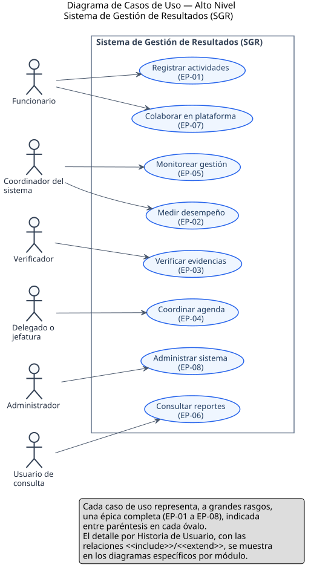

Cada óvalo representa una épica completa (EP-01 a EP-08, alcance cerrado en `decisiones.md` y
`actividad-1.md` §3.1); el detalle a nivel de Historia de Usuario, con las relaciones `include`/`extend`,
se muestra en los diagramas específicos de la sección 2.

**Actores del sistema** (`guia-sgr.md` §3 + roles usados en las HU ya cerradas en Actividad 1):

| Actor | Épicas con las que interactúa |
|---|---|
| Funcionario | EP-01, EP-02, EP-03, EP-04, EP-05, EP-07 |
| Supervisor | EP-01 |
| Coordinador | EP-01, EP-02, EP-05, EP-06, EP-08 |
| Verificador | EP-03 |
| Delegado | EP-04, EP-05 |
| Administrador | EP-07, EP-08 |
| Auditor | EP-08 |
| Usuario de Consulta | EP-08 |

*Nota:* "Supervisor" y "Auditor" no forman parte de la tabla de 6 actores de `guia-sgr.md` §3, pero se
usan como actor conjunto en HU-04 ("Como Supervisor o Coordinador") y HU-30 ("Como Administrador o
Auditor"), ya cerradas en Actividad 1 — se mantienen para no contradecir esos códigos.

---

## 2. Diagrama(s) de Casos de Uso — Específicos

> Deben usar correctamente:
> - **`include`** → comportamiento obligatorio y reutilizable, que se gatilla siempre desde el caso de
>   uso principal (ej. "Validar Evidencia" incluido por distintos casos que suben evidencia).
> - **`extend`** → comportamiento opcional/condicional que extiende un caso base solo si se cumple una
>   condición (ej. "Generar Alerta" extiende "Revisar Avance").
>
> Punto de riesgo técnico común: confundir include/extend invierte la lógica y es un error clásico de
> evaluación.

Un diagrama específico por módulo (= por épica, mismo criterio de agrupación que `actividad-1.md` §3.2),
para que cada uno sea trazable directamente a sus HU. Fuente PlantUML en
[`assets/actividad-3/`](assets/actividad-3/) (un `.puml` por diagrama + `style.cfg` compartido).

### 2.1 EP-01 — Registro y gestión de actividades

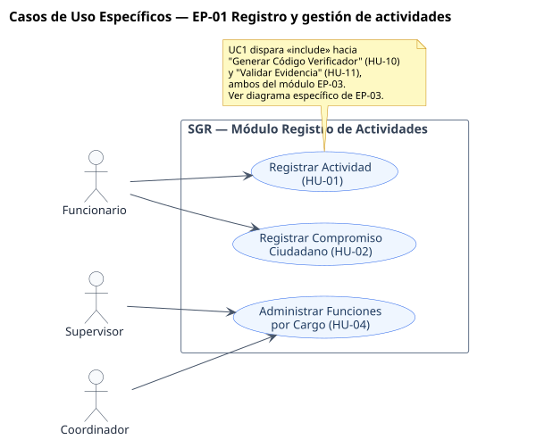

### 2.2 EP-02 — Medición y desempeño

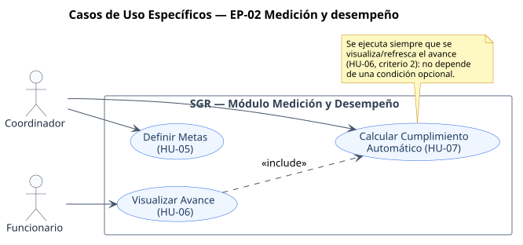

### 2.3 EP-03 — Evidencias y verificación

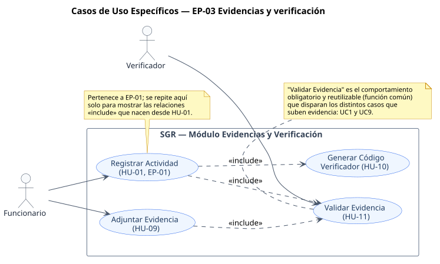

### 2.4 EP-04 — Agenda colectiva y compromisos

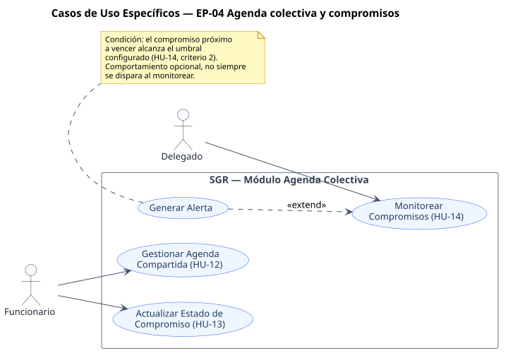

### 2.5 EP-05 — Monitoreo y control de gestión

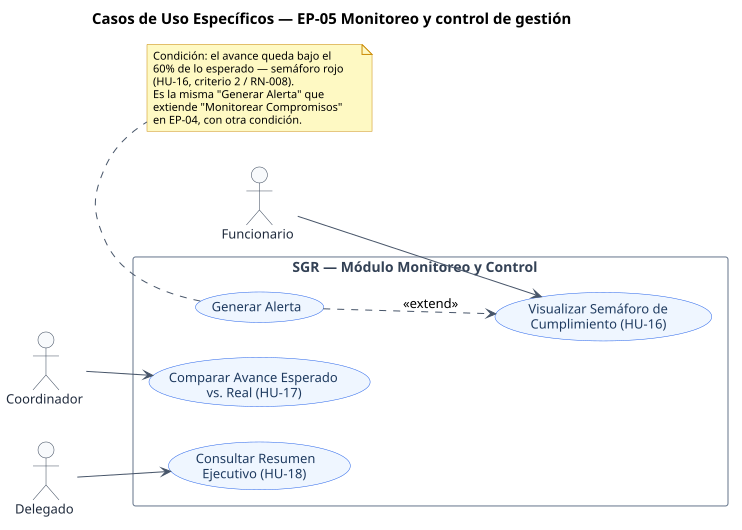

### 2.6 EP-06 — Reportabilidad y toma de decisiones

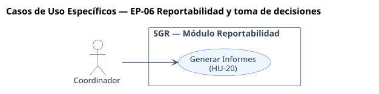

### 2.7 EP-07 — Plataforma colaborativa

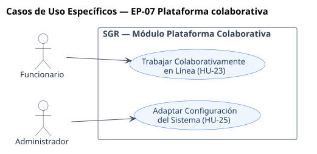

### 2.8 EP-08 — Administración, seguridad y trazabilidad

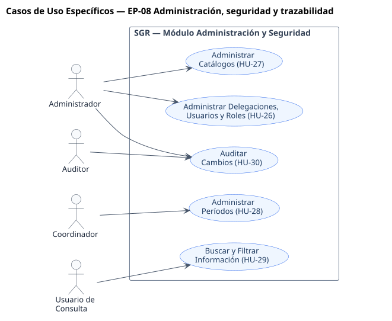

### 2.9 Relaciones include/extend usadas

| Relación | Caso base | Caso incluido/extensión | Módulo | Justificación |
|---|---|---|---|---|
| `include` | Registrar Actividad (HU-01) | Generar Código Verificador (HU-10) | EP-01→EP-03 | Todo registro válido genera siempre un código único al guardarse (HU-10, criterio 1); sin condición. |
| `include` | Registrar Actividad (HU-01) | Validar Evidencia (HU-11) | EP-01→EP-03 | La actividad puede traer evidencia, que siempre pasa por el flujo de validación del Verificador. |
| `include` | Adjuntar Evidencia (HU-09) | Validar Evidencia (HU-11) | EP-03 | Segundo caso que "sube evidencia" e incluye la misma validación — coincide con el ejemplo del profesor en `audio-clase-2.md`. |
| `include` | Visualizar Avance (HU-06) | Calcular Cumplimiento Automático (HU-07) | EP-02 | El recálculo ocurre siempre que se visualiza/refresca el panel (HU-06, criterio 2), sin condición opcional. |
| `extend` | Generar Alerta | Monitorear Compromisos (HU-14) | EP-04 | Solo se dispara si el compromiso alcanza el umbral de vencimiento configurado (HU-14, criterio 2) — condicional. |
| `extend` | Generar Alerta | Visualizar Semáforo de Cumplimiento (HU-16) | EP-05 | Solo se dispara si el avance cae bajo el 60 % esperado (HU-16, criterio 2 / RN-008) — condicional. |

Es la misma "Generar Alerta" en ambos `extend` (EP-04 y EP-05): coherente con el patrón Observer que se
documentará en el diagrama de clases (punto 3 — ver la nota sobre HU-14/HU-16 más abajo en este mismo
archivo). No se fuerza ningún `include`/`extend` adicional sin un caso concreto que lo sustente dentro
de las HU del MVP.

---

## 3. Diagrama de Clases

> Estructurar lógicamente las entidades del dominio del sistema (ej. Funcionario, Actividad, Evidencia,
> Delegación, Meta, según el caso SGR). Incluir atributos, métodos relevantes y relaciones (asociación,
> composición, herencia si aplica).

> **Patrones de diseño a evaluar (ver `fuentes/apuntes-cocreacion-patrones.md`, sección "Patrones de
> diseño en software"):** el ramo cubre 4 patrones GoF (Gamma et al., 1995) que pueden sumar puntos si
> se justifican con un caso real dentro del dominio SGR, no solo se nombran:
> - **Singleton** — para un componente con una única instancia global (ej. gestor de configuración,
>   conexión a base de datos, servicio de logging del sistema).
> - **Factory** — si el sistema crea distintos tipos de objetos según una condición en tiempo de
>   ejecución (ej. generación de distintos tipos de reportes según el módulo — ver HU-20).
> - **Observer** — para relaciones 1-a-muchos donde varios objetos deben enterarse de un cambio de
>   estado (ej. alertas por vencimiento o umbral — ver HU-14, HU-16 — coherente con el `extend` ya
>   definido en la sección 2).
> - **Adapter** — si el sistema integra un servicio externo con una interfaz distinta a la esperada
>   (ej. autenticación con directorio institucional — ver RNF-004).
>
> No es obligatorio forzar los 4 patrones: se documenta solo el o los que tengan un caso de uso real y
> justificable dentro de las 22 HU del MVP, indicando en el diagrama qué clase(s) lo implementan.

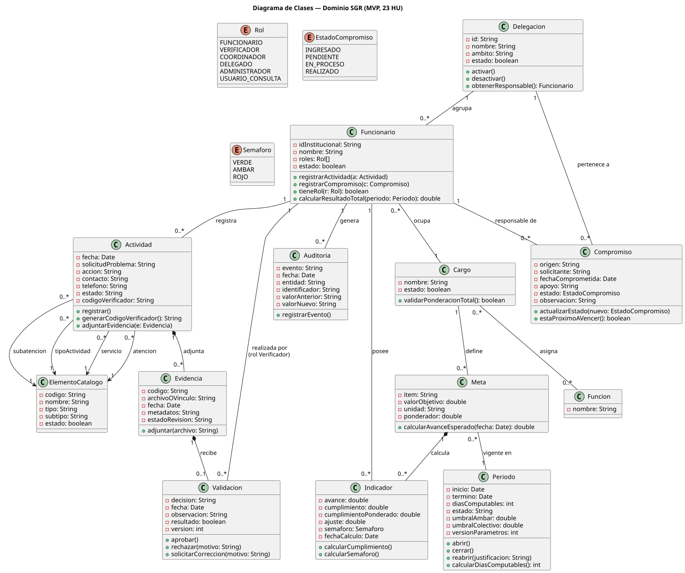

**Entidades:** las 11 de `guia-sgr.md` §8 (Delegación, Funcionario, Cargo, Período, Meta, Actividad,
Compromiso, Evidencia, Validación, Indicador, Auditoría) + `ElementoCatalogo` (HU-27) + el enum `Rol`
(roles de la tabla de actores, sección 1). `EstadoCompromiso` y `Semaforo` quedan como enum porque su
conjunto de valores es cerrado (RF-018 y RN-008/§7.1 respectivamente).

**Relaciones destacadas:**
- Composición (`Actividad *— Evidencia`, `Evidencia *— Validación`, `Meta *— Indicador`): la parte no
  tiene sentido ni ciclo de vida propio fuera de su todo — una Evidencia no existe sin la Actividad que
  la originó (RF-012), una Validación no existe sin la Evidencia que califica (RF-013), un Indicador es
  el cálculo derivado de una Meta puntual (RF-023/024).
- `Actividad "1" *-- "0..*" Evidencia`: 1 a muchos según RN-010 ("relación uno a uno o uno a muchos
  según el tipo de actividad").
- `Actividad --> ElementoCatalogo` (4 asociaciones con rol: `tipoActividad`, `servicio`, `atencion`,
  `subatencion`): `guia-sgr.md` §8.1 enumera, dentro de los campos mínimos del registro de actividad,
  "ítem, servicio, tipo y subtipo de atención" — cuatro clasificaciones, no una sola — y RF-004 ya
  reconoce esas mismas cuatro categorías como entidades separadas dentro del catálogo ("tipos de
  actividad, servicio, atención y subatención por área"). Una única asociación solo permitiría guardar
  una de las cuatro por actividad, lo que impide un caso real y frecuente del dominio (ej. una visita a
  terreno por poda de árboles registrada como atención comunitaria/reclamo, donde las cuatro
  clasificaciones aplican a la vez). Se modelan entonces como cuatro asociaciones independientes hacia
  la misma clase `ElementoCatalogo`, cada una con su propio rol — no como una redefinición de RF-009 ni
  de HU-01 (que se mantienen sin cambios), sino como la traducción a UML de lo que §8.1 ya enumera.
- El resto queda como asociación simple (agrupa, ocupa, define, etc.): ambos lados pueden existir
  independientemente (ej. una Delegación sigue existiendo aunque un Funcionario se desvincule).

### 3.1 Patrones de diseño aplicados

Se documentan 3 de los 4 patrones citados por el ramo — cada uno con un caso real dentro de las 23 HU
del MVP, no solo el nombre. El cuarto patrón sugerido por el material del curso (Adapter, pensado para
integrar un servicio externo con una interfaz distinta a la esperada — ver la cita de la sección 3
arriba) no tiene hoy un caso de uso real que lo sustente: la autenticación se resuelve con el sistema
propio de Django (`django.contrib.auth`, ver sección 6), sin ningún servicio externo que requiera
traducción de interfaz. Como la propia cita de instrucciones aclara, "no es obligatorio forzar los 4
patrones", así que se documentan solo los 3 con caso de uso real y justificable.

| Patrón | Clase(s) | HU/RF/RNF que lo sustenta |
|---|---|---|
| Singleton | `ConfiguracionSistema` | HU-25 (adaptar configuración), RNF-013/014/015 |
| Factory | `InformeFactory` / `InformeFactoryImpl` | HU-20 (tipos de informe según módulo) |
| Observer | `IObservadorAlerta` / `GeneradorAlertas` | HU-14, HU-16, RF-037 — mismo `extend` de la sección 2 |

#### Singleton — `ConfiguracionSistema`

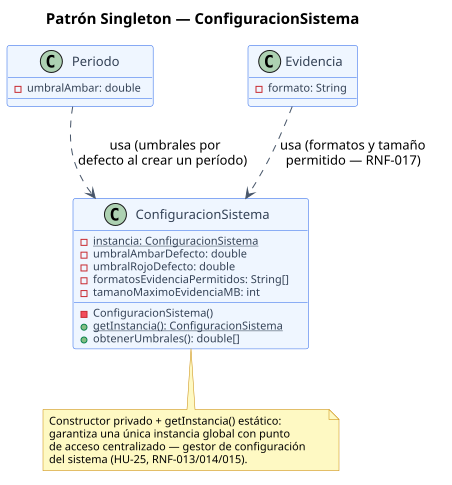

Instancia única (constructor privado + `getInstancia()` estático) que centraliza parámetros hoy
dispersos entre HU: umbrales por defecto del semáforo (HU-16/RN-008) y formatos/tamaño permitido de
evidencia (RNF-017), con un único punto de acceso en vez de que cada clase mantenga su propia copia.

#### Factory — `InformeFactory`

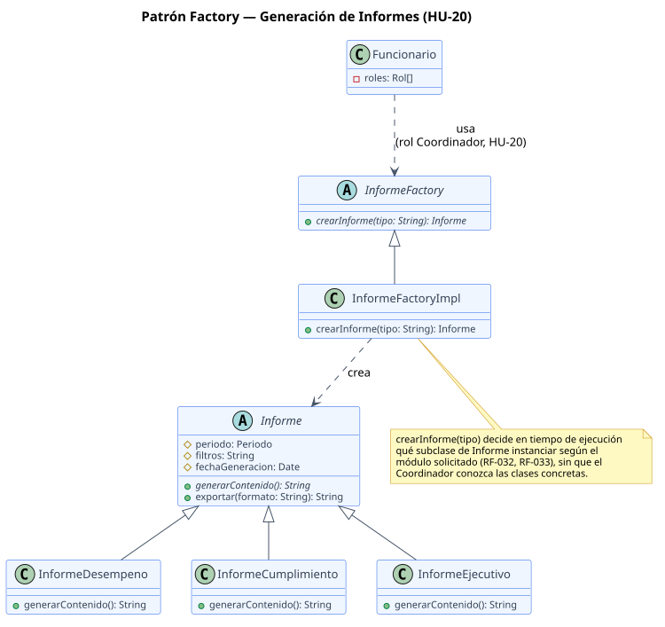

`InformeFactory.crearInforme(tipo)` decide en tiempo de ejecución qué subclase de `Informe` instanciar
(Desempeño, Cumplimiento, Ejecutivo) sin que el Coordinador (HU-20) conozca las clases concretas —
coincide con el ejemplo del propio enunciado ("distintos tipos de reportes según el módulo").

#### Observer — `IObservadorAlerta`

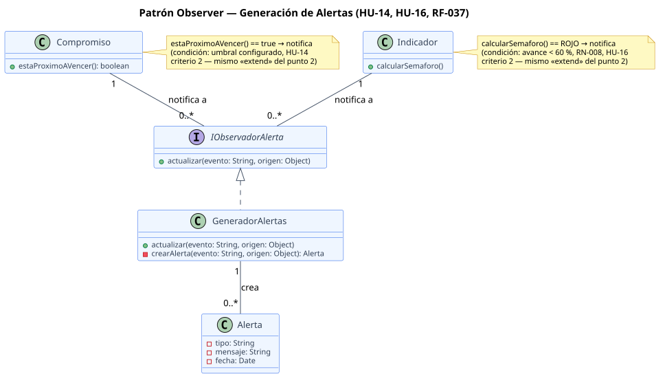

`Compromiso` e `Indicador` notifican a sus observadores cuando cambia su estado (compromiso próximo a
vencer, semáforo en rojo); `GeneradorAlertas` es el observador concreto que crea la `Alerta`. Es la
misma relación que ya se fijó como `extend` en la sección 2 (EP-04 y EP-05) — este diagrama solo
formaliza en clases esa misma decisión, no introduce una nueva.

---

## 4. Diagrama de Secuencia

> No aparece mencionado en las instrucciones ni en los audios, pero sí está explícito en la Rúbrica 2
> (dimensión "Análisis de los recursos...", 40%). Conviene incluirlo igual para no perder puntaje en esa
> dimensión. Típicamente uno por cada caso de uso principal.

Se eligieron 5 flujos representativos (no las 23 HU una por una): cubren la mayoría de las épicas y, en
particular, ponen en acción los 3 patrones y las relaciones `include`/`extend` ya fijadas en las
secciones 2 y 3, para que las tres vistas (casos de uso, clases, secuencia) cuenten la misma historia.

### 4.1 Registrar Actividad con Evidencia y Validación

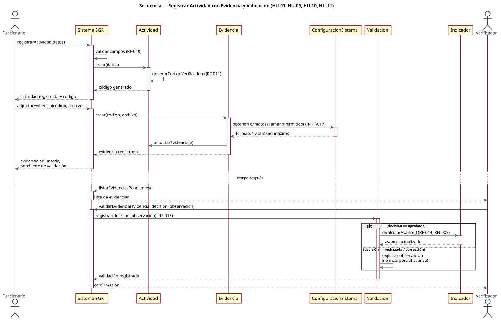

Recorre en orden los dos `include` de EP-03 (sección 2.9): Registrar Actividad → Generar Código
Verificador, y Adjuntar Evidencia → Validar Evidencia — además del uso de `ConfiguracionSistema`
(Singleton) al validar el formato de la evidencia.

### 4.2 Visualizar Avance y Calcular Cumplimiento

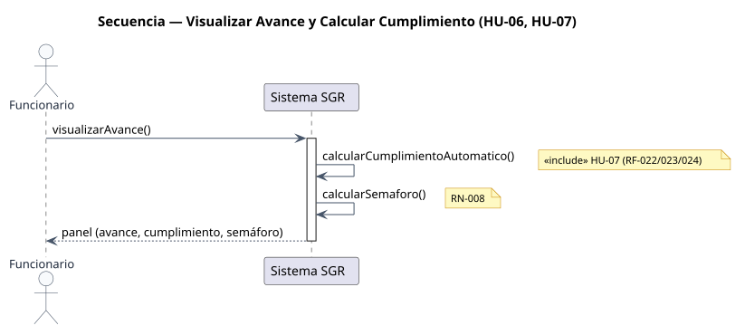

El `include` de EP-02 (Visualizar Avance → Calcular Cumplimiento Automático) en su forma más simple:
sin actor adicional, solo el recálculo obligatorio al refrescar el panel.

### 4.3 Notificación de Alertas (Observer)

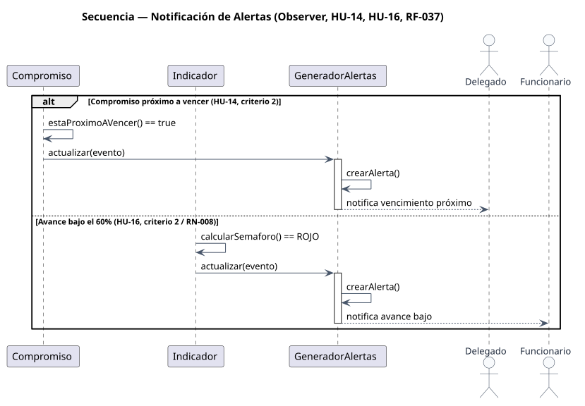

Un `alt` con las dos condiciones que ya eran `extend` en la sección 2 (HU-14 y HU-16), mostrando cómo
ambas convergen en el mismo `GeneradorAlertas` (patrón Observer de la sección 3.1), pero notifican a
actores distintos (Delegado vs. Funcionario).

### 4.4 Generar Informe (Factory)

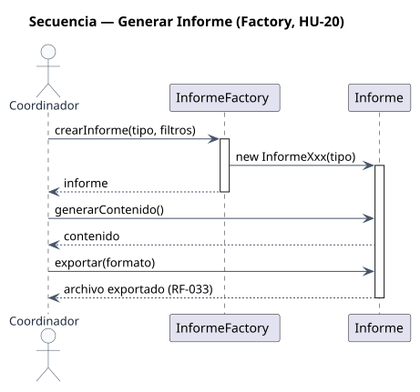

`InformeFactory` crea la subclase concreta de `Informe` (HU-20) sin que el Coordinador la conozca —
misma decisión de diseño que la sección 3.1.

### 4.5 Administrar Delegaciones, Usuarios y Roles

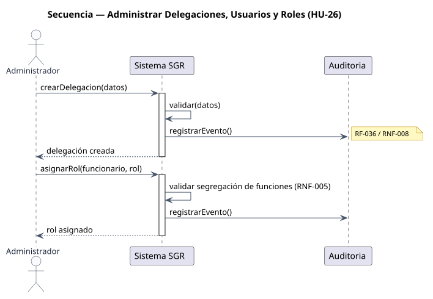

Flujo representativo del módulo de administración (EP-08, HU-26): cada operación crítica queda
registrada en `Auditoria` (RF-036, RNF-008), consistente con la entidad ya definida en el diagrama de
clases.

---

## 5. Diagrama de Componentes

> Enfocado en los componentes internos y consumos de servicios del software (ej. cómo el frontend
> consume la API, cómo la API consume la base de datos, servicios externos si los hay).

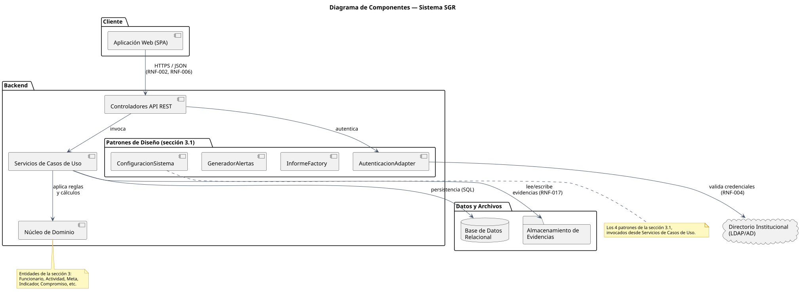

Sigue los 4 bloques de `guia-sgr.md` §14.1 (Interfaz / API y aplicación / Dominio / Datos y archivos). El
diagrama nombra los componentes por su responsabilidad lógica (qué hace cada pieza), no por el nombre de
la tecnología que la implementa — el framework de backend ya está fijado como Django en `actividad-2.md`
§2.2 (Etapa de producción/operación), y esa decisión no cambia la estructura ni los consumos de servicio
que se ven aquí, solo indica con qué herramienta concreta se construirá cada bloque. El motor de base de
datos relacional, en cambio, sigue abierto (`actividad-2.md` §2.2 lo marca como "por definir"), así que
ese componente permanece sin comprometerse a un motor específico hasta que el equipo lo decida.

**Consumos de servicio:**
- Cliente → API: HTTPS/JSON (RNF-002 rendimiento, RNF-006 confidencialidad → implica TLS).
- API → Servicios de Casos de Uso → Núcleo de Dominio: las reglas y cálculos de la sección 3.
- Servicios de Casos de Uso → Base de Datos: persistencia relacional.
- Servicios de Casos de Uso → Almacenamiento de Evidencias: lectura/escritura de archivos (RNF-017).
- API → Módulo de Autenticación → Base de Datos: valida credenciales contra la tabla de usuarios
  (hash, RNF-004), sin servicios externos — ver sección 6 para el detalle de despliegue.

---

## 6. Diagrama de Despliegue

> Infraestructura física y lógica: hardware, software y consumos (nodos como servidor web, servidor BD,
> cliente; protocolos de comunicación entre ellos). **Debe vincularse directamente con los recursos de
> hardware/software mínimos y óptimos definidos en la Actividad 2** — no pueden ser inconsistentes entre
> sí.

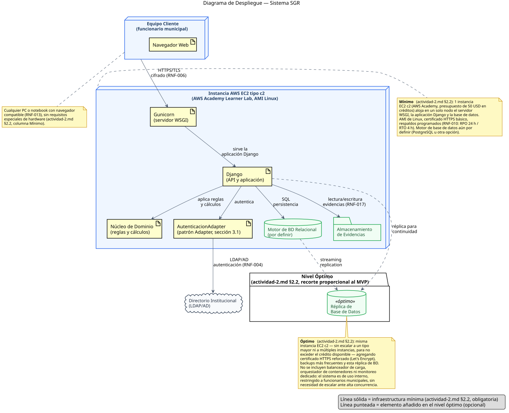

**Nivel Mínimo** (`actividad-2.md` §2.2, obligatorio): una única instancia AWS EC2 tipo c2 (cuenta AWS
Academy Learner Lab, presupuesto de 50 USD en créditos) con AMI de Linux aloja en el mismo nodo a
Gunicorn (servidor WSGI), la aplicación Django, el núcleo de dominio, el módulo de autenticación
(`django.contrib.auth`) y el motor de base de datos — no se separa la BD a un nodo distinto en el
mínimo. La autenticación se resuelve con el sistema propio de Django (contraseñas con hash seguro y
sesiones protegidas), cumpliendo RNF-004 y los controles de identidad de `guia-sgr.md` §14.2, sin
depender de un directorio institucional externo: el enunciado solo recomienda esa integración
("se recomienda", RNF-004), no la exige, y el equipo optó por la alternativa más simple y realista para
el plazo del MVP. El equipo cliente no tiene requisitos especiales de hardware, solo un navegador
compatible (RNF-013). Software mínimo: AMI de Linux, certificado HTTPS básico y respaldos programados
(RNF-010: RPO 24 h / RTO 4 h). El motor de base de datos queda marcado como pendiente de definir, igual
que en `actividad-2.md` §2.2.

**Nivel Óptimo** (`actividad-2.md` §2.2, opcional, recorte proporcional al MVP): representado con línea
punteada, agrega únicamente una réplica de la base de datos (streaming replication) para continuidad,
además de certificado HTTPS reforzado y backups más frecuentes — sin escalar a un tipo de instancia
mayor ni a múltiples instancias, para no exceder el crédito disponible de AWS Academy. A diferencia de
una versión anterior de este diagrama, no se incluyen balanceador de carga, orquestador de contenedores
ni monitoreo dedicado: esas piezas resuelven problemas de alta concurrencia o alta disponibilidad
crítica que no aplican a un sistema de uso interno, restringido a funcionarios municipales, en etapa
MVP. El diagrama fue verificado contra `actividad-2.md` sección 2.2 antes de darse por cerrado.

---

## 7. Diagrama de Requerimientos (en árbol)

> Representación jerárquica y en ramas: Requerimiento Funcional → Épica → Historia de Usuario → Tareas
> de desarrollo. Funciona como mapa visual del avance del proyecto, pensado para poder cruzarse con el
> estado real del tablero de trabajo (Actividad 1, sección 5).

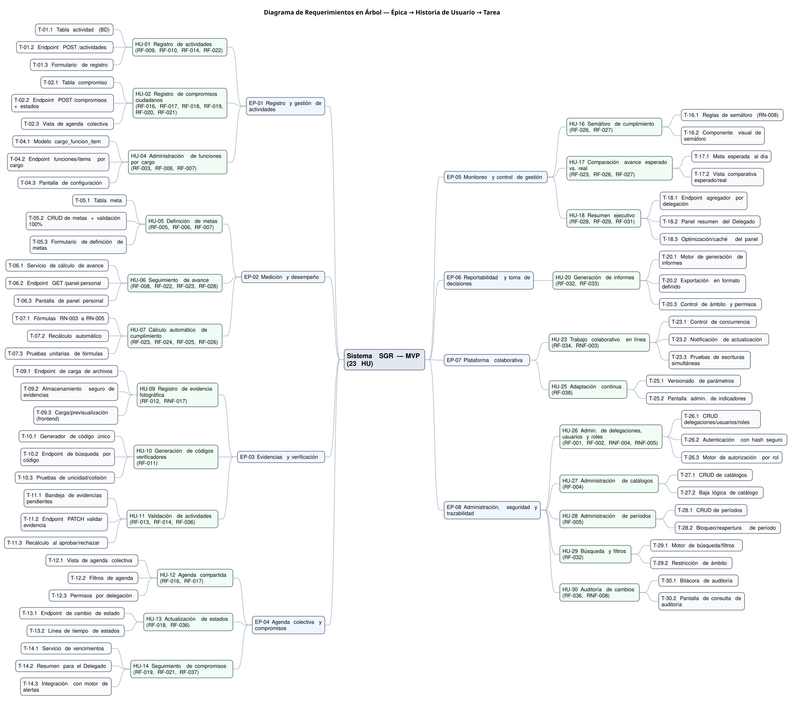

El árbol respeta la jerarquía real, sin duplicar ramas: cada Épica (las 8 de `actividad-1.md` §3.1)
agrupa únicamente sus propias Historias de Usuario (23 en total, igual que el backlog de §5), y cada HU
agrupa únicamente sus propias Tareas (61 en total, igual que §3.3 — conteo verificado contra esa tabla
antes de armar el diagrama).

**Dónde queda el "Requerimiento Funcional" de la cadena.** En vez de ubicar cada RF/RNF como raíz de su
propia rama, se muestra como etiqueta bajo el nombre de cada HU — la misma línea "Requisitos
relacionados" ya usada en `actividad-1.md` §3.2. La razón es que 16 de los 40 RF/RNF citados por alguna
HU sustentan **más de una HU, en épicas distintas** (por ejemplo RF-036 en HU-11, HU-13 y HU-30 — EP-03,
EP-04 y EP-08 —, o RF-023 en HU-06, HU-07 y HU-17 — EP-02 y EP-05): ponerlos como primer nivel de
ramificación obligaría a repetir la HU completa (con sus tareas) una vez por cada requisito que la
sustenta, rompiendo la jerarquía real de "una HU vive en una sola épica" que ya usa el tablero de la
sección 5. Mostrar el RF/RNF como atributo de la HU mantiene el árbol fiel a esa jerarquía y conserva la
trazabilidad completa igual: cada hoja sigue siendo rastreable hasta su(s) requisito(s).

Quedan fuera del árbol los 13 RNF transversales que `actividad-1.md` §1.4 marca como "incluidos por
completitud del MVP" (RNF-001, RNF-002, RNF-006, RNF-007, RNF-009 a RNF-016, RNF-018): no sustentan una
HU puntual, sino que aplican por igual a cualquier rama (ver su definición real en `guia-sgr.md` §6),
así que forzarlos dentro de una rama específica contradiría su propia naturaleza transversal.

**Cruce con el tablero real (Actividad 1, §5):** cada hoja "Tarea" de este árbol corresponde a una fila
de la tabla "Tareas por Historia de Usuario" (§3.3); cada nodo de HU corresponde a una tarjeta del
backlog priorizado (§5-b), con el mismo código, el mismo nombre y la misma épica — de modo que, cuando
el tablero avance, el estado de cada tarjeta puede anotarse directamente sobre este mismo árbol sin
tener que reconstruirlo.

---

## 8. Wireframes + Matriz de Trazabilidad

> Se exige una cadena de trazabilidad estricta y obligatoria, elemento por elemento:
>
> **Requerimiento (Funcional o No Funcional) → Épica → Historia de Usuario → Caso de Uso de Alto Nivel
> → Caso de Uso Específico → Wireframe**
>
> **Nota sobre una discrepancia real:** el enunciado escrito dice que la cadena parte de RF/RNF (ambos).
> En `fuentes/audio-clase-2.md` el profesor menciona en clase que parte de RNF específicamente. Si no se
> ha confirmado con el docente, la opción más segura es documentar la trazabilidad completa incluyendo
> tanto RF como RNF relevantes por cada wireframe, dejando explícito el criterio usado.

### 8.1 Wireframes

Wireframes de baja fidelidad (boceto funcional en escala de grises, sin diseño visual final), una
pantalla por flujo funcional distinto — no una por HU, ya que varias HU comparten formulario o panel
porque así lo agrupa el propio dominio. Las 12 pantallas cubren, verificadas una por una, las 23 HU
cerradas en `actividad-1.md` §3.2. El contenido de cada pantalla (campos, botones, estados, texto exacto)
se derivó línea por línea de los criterios Dado/Cuando/Entonces de cada HU, de los atributos reales de
`clases-dominio.puml` y de los nombres de caso de uso ya fijados en los `.puml` de la sección 2; el
generador de imágenes solo ejecutó el layout ya decidido. Fuente de cada wireframe en
[`assets/actividad-3/wireframes/`](assets/actividad-3/wireframes/).

#### Pantalla 1 — Inicio de Sesión

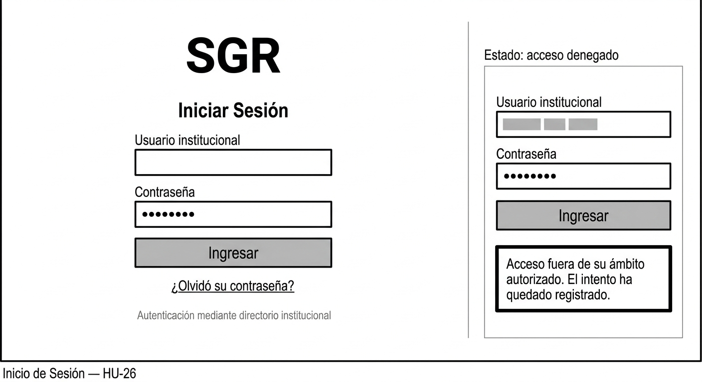

Única pantalla sin barra superior ni lateral (previa a la autenticación). Muestra el formulario en blanco
junto al estado de acceso denegado de HU-26 criterio 2 ("Dado un usuario sin autorización, cuando intenta
acceder fuera de su ámbito, entonces el acceso se deniega y el intento queda registrado").

#### Pantalla 2 — Registrar Actividad con Evidencia

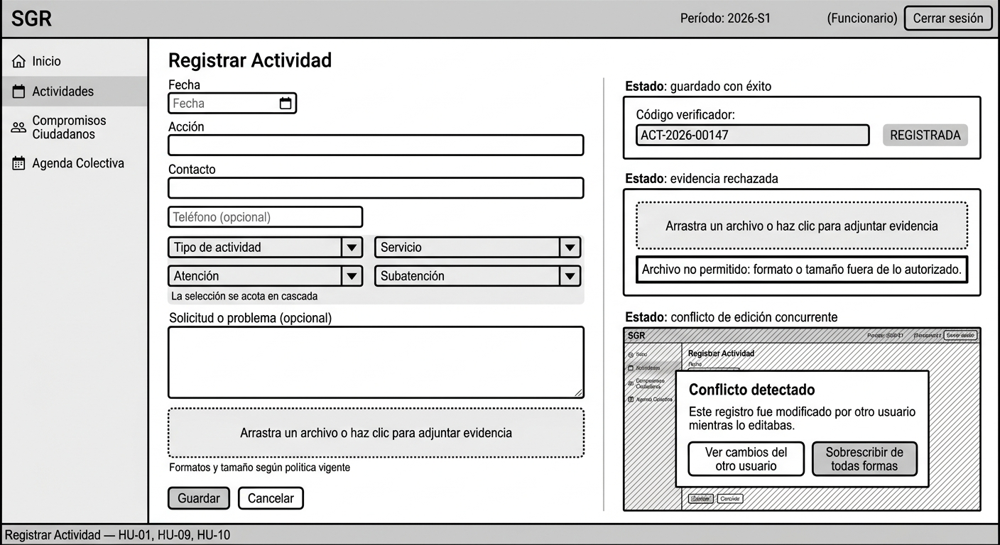

Formulario de HU-01 con adjuntar evidencia (HU-09) y generación de código verificador (HU-10) al guardar,
más el modal de conflicto de edición concurrente de HU-23 criterio 2. El wireframe incorpora los 4
selectores en cascada (tipo de actividad, servicio, atención, subatención) que corresponden a las 4
asociaciones con rol entre `Actividad` y `ElementoCatalogo` (ver punto 3, "Relaciones destacadas"),
quedando así consistente con el diagrama de clases.

#### Pantalla 3 — Validar Evidencia

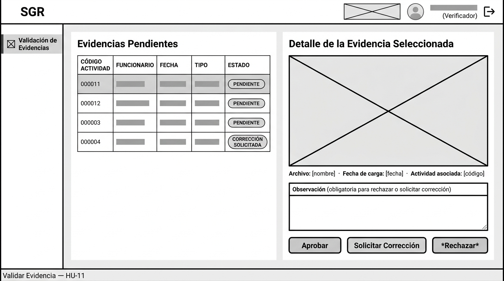

Cola de evidencias pendientes (rol Verificador) con panel de detalle, observación obligatoria para
rechazar o solicitar corrección (HU-11 criterio 1).

#### Pantalla 4 — Registrar Compromiso Ciudadano

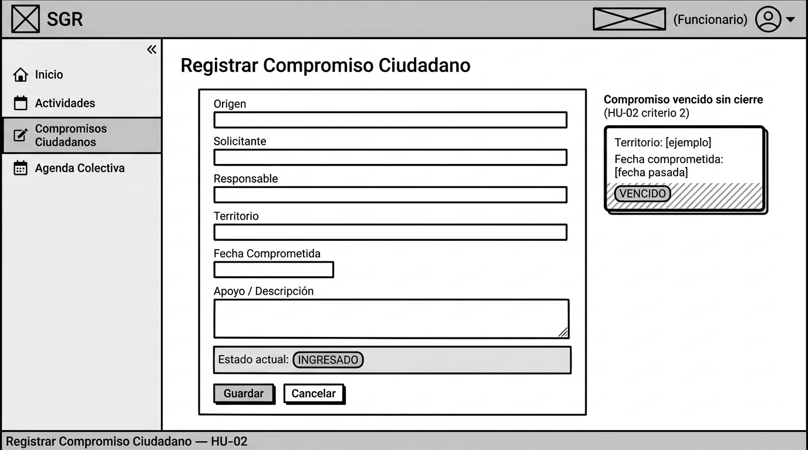

Formulario de HU-02, con el estado "VENCIDO" de un compromiso sin cierre (HU-02 criterio 2) mostrado como
panel aparte.

#### Pantalla 5 — Agenda Colectiva Compartida

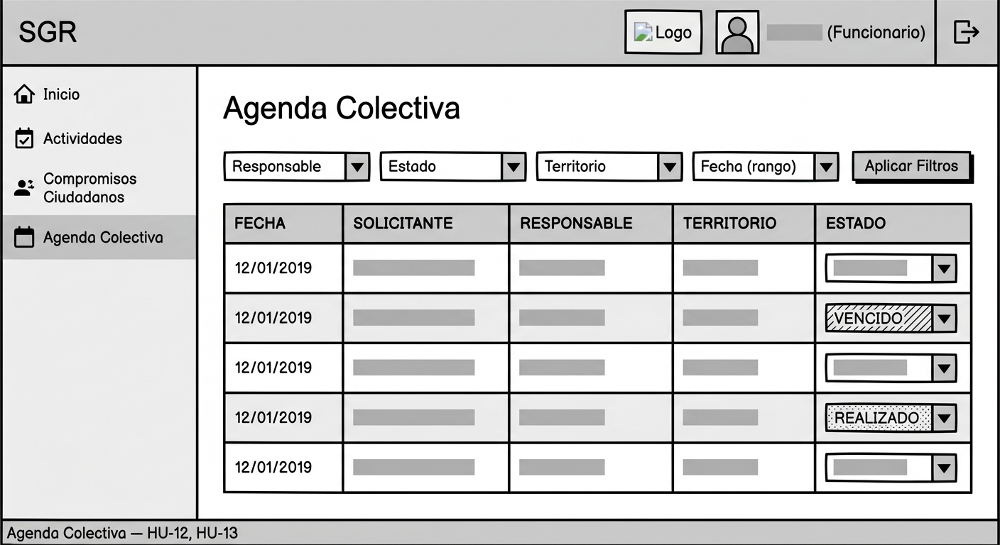

Tabla ordenada por fecha con filtros (HU-12) y cambio de estado inline por fila que conserva historial
(HU-13).

#### Pantalla 6 — Mi Avance (panel del Funcionario + Semáforo)

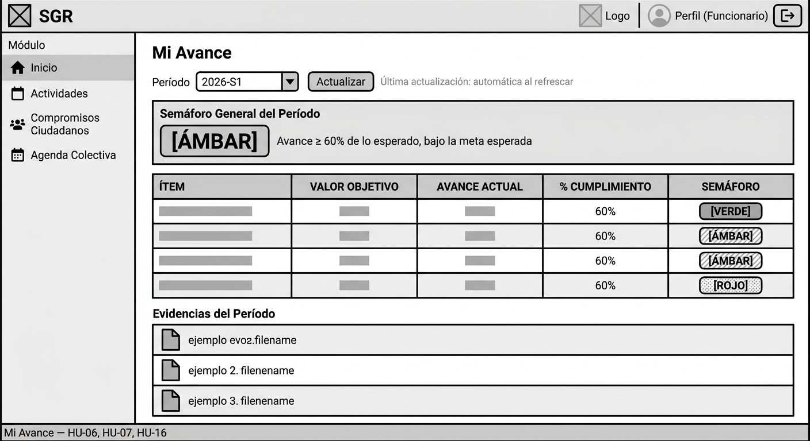

Semáforo general del período (HU-16) y tabla de metas con recálculo automático al refrescar (HU-07),
aplicando la regla RN-008 exacta: verde si avance ≥ meta esperada, ámbar si avance ≥ 60 % de la meta y
menor que ella, rojo si avance < 60 % — cada estado con etiqueta de texto entre corchetes y patrón de
relleno distinto, nunca solo color (HU-06).

#### Pantalla 7 — Funciones y Metas por Cargo

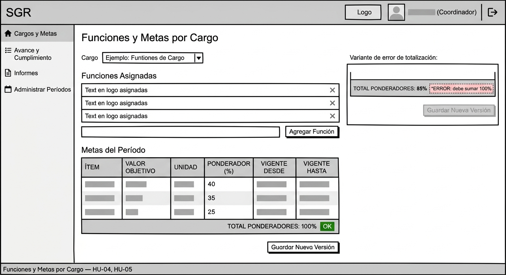

Gestión de funciones asignadas por cargo (HU-04) y tabla de metas con validación de que los ponderadores
sumen 100 % (RN-001), incluyendo el estado de error cuando no totalizan (HU-05).

#### Pantalla 8 — Comparación de Avance Esperado vs. Real

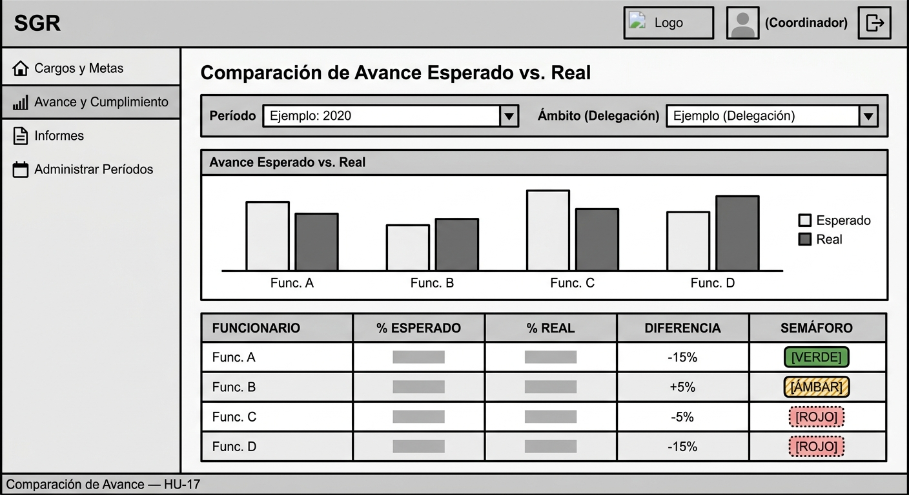

Gráfico comparativo esperado/real y tabla con diferencia y semáforo por funcionario (HU-17).

#### Pantalla 9 — Resumen Ejecutivo y Seguimiento de Compromisos

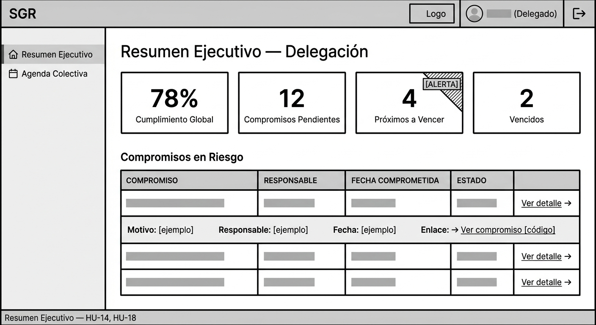

Tarjetas KPI (HU-18) y tabla de compromisos en riesgo con una fila expandida que reproduce los 4 campos
exactos que exige una alerta según RF-037: motivo, responsable, fecha y enlace al elemento afectado
(HU-14).

#### Pantalla 10 — Generación de Informes

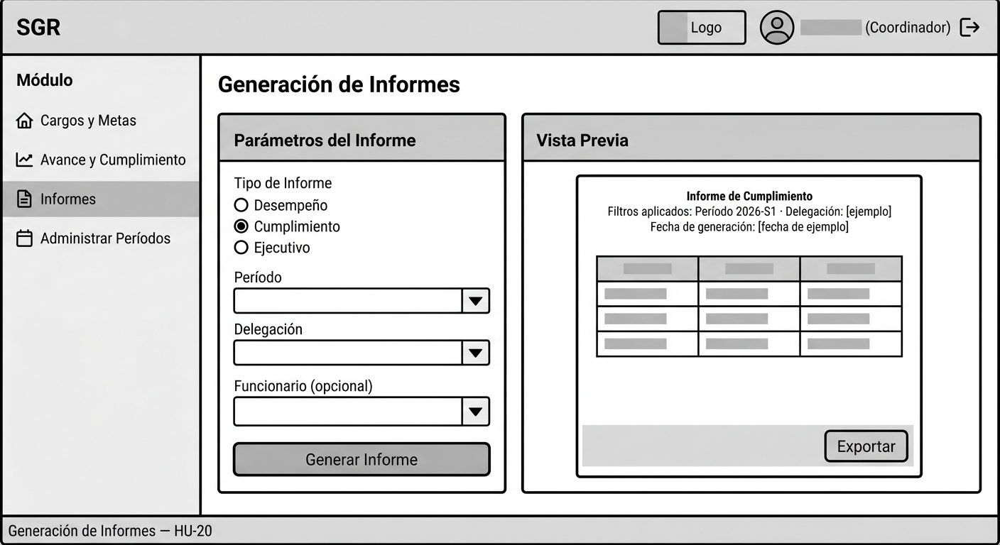

Selección de tipo de informe (Desempeño / Cumplimiento / Ejecutivo, subclases de `InformeFactory`) con
vista previa que conserva encabezados, filtros aplicados y fecha de generación (HU-20).

#### Pantalla 11 — Administración del Sistema (5 pestañas)

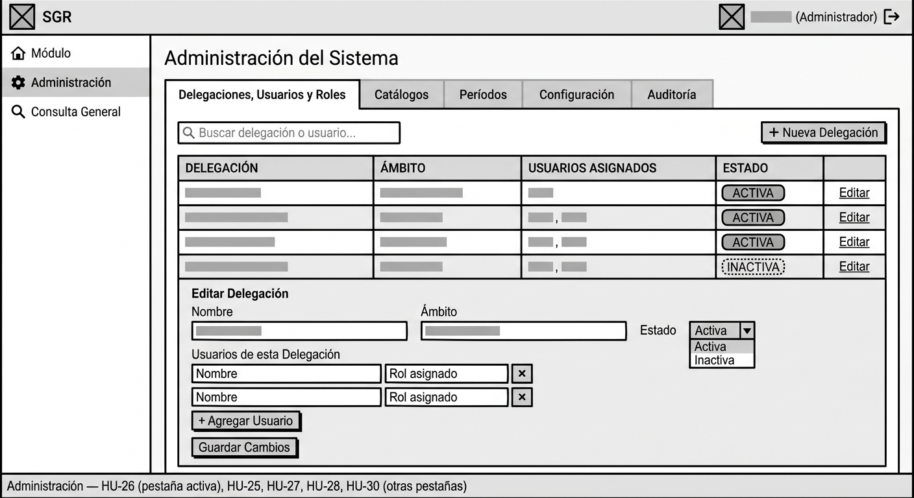

Agrupa 5 HU bajo el mismo actor (Administrador) y el mismo patrón visual de tabla + formulario de
alta/edición: Delegaciones, Usuarios y Roles (HU-26, pestaña detallada en el wireframe), Catálogos
(HU-27), Períodos (HU-28), Configuración (HU-25) y Auditoría (HU-30).

#### Pantalla 12 — Consulta y Búsqueda General

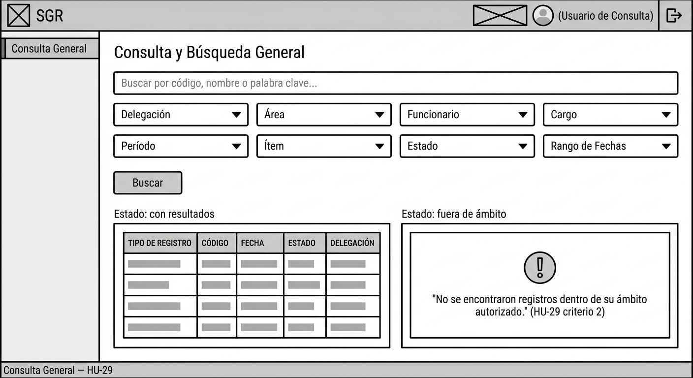

Los 8 filtros exactos de RF-032 (delegación, área, funcionario, cargo, período, ítem, estado, rango de
fechas) y el estado de "fuera de ámbito autorizado" de HU-29 criterio 2.

### 8.2 Matriz de trazabilidad

| Wireframe | RF/RNF | Épica | HU | CU alto nivel | CU específico |
|---|---|---|---|---|---|
| Inicio de Sesión | RF-001, RF-002, RNF-004, RNF-005 | EP-08 | HU-26 | EP-08 Administrar el Sistema | Administrar Delegaciones, Usuarios y Roles (HU-26) |
| Registrar Actividad con Evidencia | RF-009, RF-010, RF-011, RF-012, RF-014, RF-022, RF-034, RNF-003, RNF-017 | EP-01, EP-03 | HU-01, HU-09, HU-10, HU-23 | EP-01 Registrar y Administrar Actividades; EP-03 Gestionar Evidencias | Registrar Actividad (HU-01) →include→ Generar Código Verificador (HU-10); Adjuntar Evidencia (HU-09) |
| Validar Evidencia | RF-013, RF-014, RF-036 | EP-03 | HU-11 | EP-03 Gestionar Evidencias | Validar Evidencia (HU-11) |
| Registrar Compromiso Ciudadano | RF-016 a RF-021 | EP-01 | HU-02 | EP-01 Registrar y Administrar Actividades | Registrar Compromiso Ciudadano (HU-02) |
| Agenda Colectiva Compartida | RF-016, RF-017, RF-018, RF-036 | EP-04 | HU-12, HU-13 | EP-04 Gestionar Agenda Colectiva | Gestionar Agenda Compartida (HU-12); Actualizar Estado de Compromiso (HU-13) |
| Mi Avance (panel + semáforo) | RF-008, RF-022 a RF-028 | EP-02, EP-05 | HU-06, HU-07, HU-16 | EP-02 Medir Desempeño; EP-05 Monitorear y Controlar la Gestión | Visualizar Avance (HU-06) →include→ Calcular Cumplimiento Automático (HU-07); Visualizar Semáforo de Cumplimiento (HU-16) |
| Funciones y Metas por Cargo | RF-003, RF-005, RF-006, RF-007 | EP-01, EP-02 | HU-04, HU-05 | EP-01 Registrar y Administrar Actividades; EP-02 Medir Desempeño | Administrar Funciones por Cargo (HU-04); Definir Metas (HU-05) |
| Comparación Avance Esperado vs. Real | RF-023, RF-026, RF-027 | EP-05 | HU-17 | EP-05 Monitorear y Controlar la Gestión | Comparar Avance Esperado vs. Real (HU-17) |
| Resumen Ejecutivo + Seguimiento de Compromisos | RF-019, RF-021, RF-028, RF-029, RF-031, RF-037 | EP-05, EP-04 | HU-18, HU-14 | EP-05 Monitorear y Controlar la Gestión; EP-04 Gestionar Agenda Colectiva | Consultar Resumen Ejecutivo (HU-18); Monitorear Compromisos (HU-14) →extend→ Generar Alerta |
| Generación de Informes | RF-032, RF-033 | EP-06 | HU-20 | EP-06 Generar Reportes | Generar Informes (HU-20) |
| Administración del Sistema | RF-001, RF-002, RF-004, RF-005, RF-036, RF-038, RNF-004, RNF-005, RNF-008 | EP-07, EP-08 | HU-25, HU-26, HU-27, HU-28, HU-30 | EP-07 Colaborar en la Plataforma; EP-08 Administrar el Sistema | Adaptar Configuración del Sistema (HU-25); Administrar Delegaciones, Usuarios y Roles (HU-26); Administrar Catálogos (HU-27); Administrar Períodos (HU-28); Auditar Cambios (HU-30) |
| Consulta y Búsqueda General | RF-032 | EP-08 | HU-29 | EP-08 Administrar el Sistema | Buscar y Filtrar Información (HU-29) |

_(Un renglón completo por cada wireframe presentado, no solo un ejemplo. El profesor dio como modelo
justificar la pantalla de login recorriendo la cadena completa de principio a fin.)_

---

## Checklist de cierre — Actividad 3

- [x] Alcance verificado contra `decisiones.md` § Alcance del MVP (23 HU cerradas en Actividad 1 — ver
      nota de consistencia al inicio de este documento sobre la cifra "22" de `decisiones.md`)
- [x] Diagrama de Casos de Uso — alto nivel (desde épicas)
- [x] Diagrama(s) de Casos de Uso específicos con include/extend correctos
- [x] Diagrama de Clases del dominio
- [x] Patrón(es) de diseño identificado(s) y justificado(s) en el diagrama de clases (si aplica)
- [x] Diagrama(s) de Secuencia (exigido por la rúbrica)
- [x] Diagrama de Componentes (consumo de servicios)
- [ ] Diagrama de Despliegue (coherente con Actividad 2)
- [x] Diagrama de Requerimientos en árbol
- [x] Wireframes de las pantallas principales
- [x] Trazabilidad completa por cada wireframe (RF/RNF→Épica→HU→CU alto nivel→CU específico→Wireframe)
- [x] Verificado contra los códigos finales de Actividad 1 (sin inventar épicas/HU nuevas)
- [ ] Verificado contra los recursos de Actividad 2 (diagrama de despliegue consistente)
